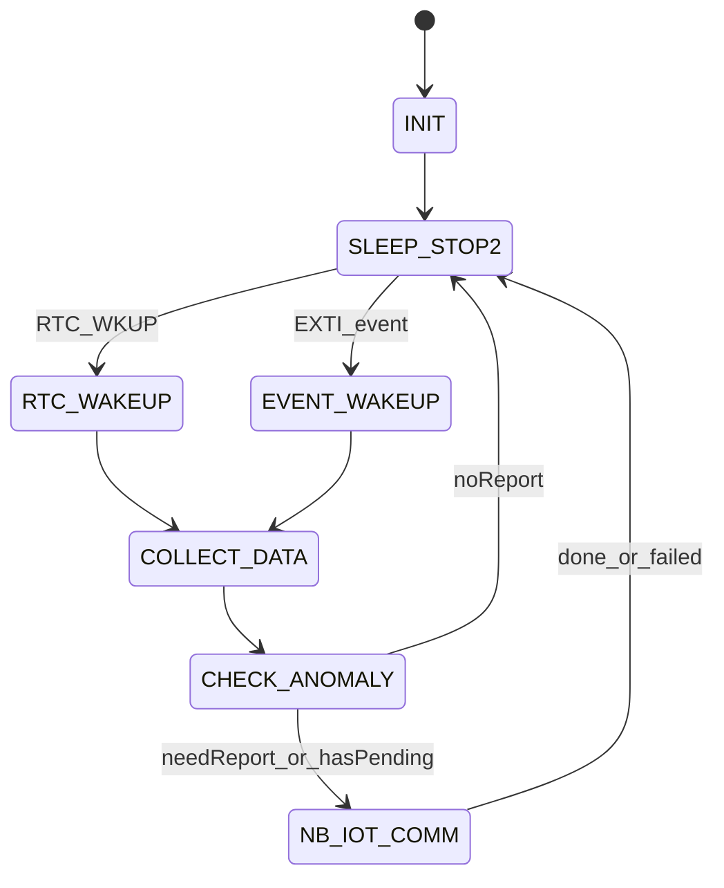
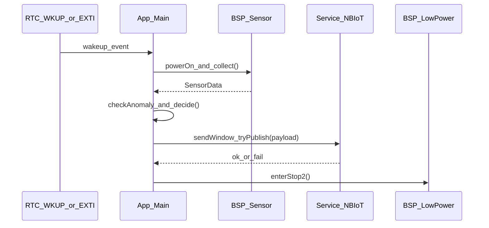
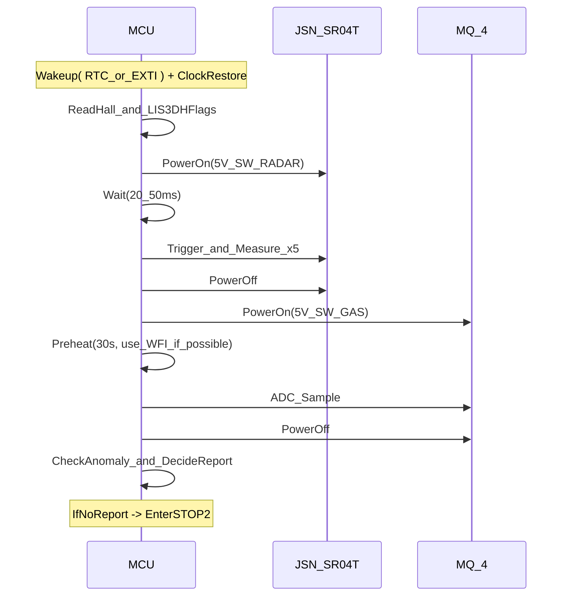

# 基于 NB-IoT 的低功耗城市下水道监控终端

## —— 软件设计说明书（Architecture & Design）

> **最后更新：2026-02-24，架构重构完成**（状态机三层架构，`app_main.c` 承载主循环）

## 0. 文档信息

- **项目名称**: 基于 NB-IoT 的低功耗城市下水道异常工况远程监控终端  
- **固件工程名**: Lowpower_01  
- **MCU 型号**: STM32L431RCT6（Cortex-M4，80 MHz，低功耗 L4 系列）  
- **通信模块**: EC-01G（NB-IoT，支持 PSM/eDRX）  
- **主要传感器**: MQ-4、JSN-SR04T、LIS3DH、霍尔传感器  
- **云平台**: 巴法云（MQTT）  
- **开发环境**: CLion + CMake + STM32CubeMX + STM32L4xx HAL  
- **核心策略**: “采集–判断–按需上报”（以低功耗为最高优先级）  

---

## 1. 总体设计

### 1.1 系统目标

- 实现对城市下水道 **沼气浓度**、**水位高度**、**井盖状态**、**异常振动** 的长期无人值守监测。  
- 通过 NB-IoT 模块 EC-01G 将监测数据上报至巴法云平台。  
- 采用 **STOP2 低功耗模式 + 事件/定时唤醒**，实现电池供电场景下的多月级续航。  

### 1.1.1 核心约束与设计取舍（毕设范围）

本项目的核心目标是**低功耗逻辑跑通**与**数据上报链路跑通**，其余能力按毕设难度做取舍：

- **优先级 P0（必须完成）**  
  - STOP2 休眠与唤醒逻辑（RTC 定时 + 至少 1 个事件唤醒源）。  
  - 传感器采集流程跑通（可先只保证“能读到数据”）。  
  - NB-IoT + MQTT 上报跑通（至少能成功发布 1 次 JSON 数据）。  
- **优先级 P1（建议完成，加分项）**  
  - 合并上报窗口 + 失败退避策略（减少上线次数，体现低功耗设计）。  
  - 简单异常阈值判断与“是否上报”的策略选择。  
- **优先级 P2（可选/后续工作）**  
  - 多条事件队列持久化（Flash/EEPROM）、断点续传、远程参数配置等复杂功能。  

### 1.1.2 非功能需求（续航与可靠性）

- **续航**：绝大多数时间处于 STOP2，仅在“采集/通信窗口”短暂唤醒。  
- **可靠性**：通信失败不阻塞主流程，采用有限次尝试 + 退避回睡眠；必要时可引入看门狗（扩展项）。  
- **可维护性**：模块化分层（App/Service/BSP），便于论文展示与后续扩展。  

### 1.2 硬件平台结构

- **主控 MCU**: STM32L431RCT6  
  - 主频 80 MHz，支持 STOP2 低功耗模式  
  - 片上外设：ADC、I2C、RTC、USART、EXTI 等  
- **通信模块**: EC-01G NB-IoT 模块  
- **传感器**:  
  - MQ-4 可燃气体传感器（模拟量，需预热）  
  - JSN-SR04T 超声波测距模块（防水型，用于水位测距）  
  - LIS3DH 三轴加速度计（I2C，运动唤醒中断）  
  - 霍尔开关传感器（检测井盖开合）  
- **电源系统**: 2×18650 锂电池（7.4 V），通过电源管理电路及 PMOS 分时控制为MQ-4 JSN-SR04T模块供电。  

### 1.3 外设与时钟配置概览

- **系统时钟**:  
  
  - MSI（内部多速振荡器）+ PLL  
  - LSE（32.768 kHz）作为 RTC 时钟源  
  - 系统时钟: 80 MHz（MSI → PLL，M=1, N=40, R=2）  
  - 电压调节: PWR_REGULATOR_VOLTAGE_SCALE1  

- **已配置外设**（CubeMX 工程）：
  
  1. **ADC1**  
     - 通道: ADC_CHANNEL_5 (PA0 / MQ_4_AO)  
     - 分辨率: 12 位，单次转换，软件触发  
     - 用途: MQ-4 气体传感器模拟信号采集  
  2. **I2C1**  
     - 引脚: PB8 (SCL), PB9 (SDA)，开漏复用  
     - 用途: LIS3DH 加速度计等 I2C 器件通信  
  3. **RTC**  
     - 时钟源: LSE 32.768 kHz  
     - 模式: 24 小时制，启用唤醒中断（RTC_WKUP_IRQn）  
  4. **USART2**  
     - 引脚: PA2 (TX), PA3 (RX)  
     - 波特率: 115200，8N1，支持中断收发（USART2_IRQn）  
     - 用途: EC-01G NB-IoT 模块 AT 指令通信  
  5. **GPIO**  
     - 负责传感器电源控制、电平采集、外部中断等。  

---

## 2. 硬件接口与引脚分配

### 2.1 核心硬件模块与型号

| 模块名称          | 型号                | 关键参数                   | 用途         |
|:------------- |:----------------- |:---------------------- |:---------- |
| **主控芯片**      | **STM32L431RCT6** | 80 MHz，Cortex-M4，STOP2 | 系统控制与低功耗管理 |
| **NB-IoT 模块** | **EC-01G**        | 支持 PSM/eDRX            | 无线数据传输     |
| **气体传感器**     | **MQ-4**          | 甲烷/天然气检测，模拟输出          | 沼气浓度监测     |
| **超声波测距**     | **JSN-SR04T**     | 25 cm–4.5 m，防水         | 水位高度监测     |
| **加速度计**      | **LIS3DH**        | I2C 接口，运动唤醒中断          | 井盖异动检测     |
| **霍尔传感器**     | A3144E（单极霍尔开关）   | 数字开关输出（1=闭合，0=打开）| 井盖开合检测     |
| **电源系统**      | 2×18650 锂电池       | 7.4 V 供电，PMOS 控制       | 供电与功耗管理    |

### 2.2 引脚分配表（MCU 侧）

| 模块             | 型号        | 引脚       | MCU 端口               | 接口类型/功能     | 备注                 |
|:-------------- |:--------- |:-------- |:-------------------- |:----------- |:------------------ |
| MQ-4 气体传感器     | MQ-4      | AO       | PA0 (MQ_4_AO)        | ADC1_IN5    | 模拟量输入              |
| MQ-4 电源控制      | MQ-4      | VCC_CTRL | PB0 (GAS_PWR_CTRL)   | GPIO 输出     | 高电平关 / 低电平开（视硬件设计） |
| JSN-SR04T 超声波  | JSN-SR04T | TRIG     | PA6 (RADAR_TRIG)     | GPIO 输出     | 触发脉冲               |
| JSN-SR04T 超声波  | JSN-SR04T | ECHO     | PA7 (RADAR_ECHO)     | GPIO 输入     | 回波测距               |
| JSN-SR04T 电源控制 | JSN-SR04T | VCC_CTRL | PB1 (RADAR_PWR_CTRL) | GPIO 输出     | 电源开关               |
| 加速度计           | LIS3DH    | SCL      | PB8 (I2C_SCL)        | I2C1_SCL    | I2C 时钟             |
| 加速度计           | LIS3DH    | SDA      | PB9 (I2C_SDA)        | I2C1_SDA    | I2C 数据             |
| 加速度计中断         | LIS3DH    | INT1     | PA8 (ACC_INT1)       | EXTI9_5，上升沿 | 运动唤醒中断             |
| 霍尔传感器          | —         | DO       | PC5 (HALL_DO)        | GPIO 输入，下拉  | 井盖状态输入             |
| 用户按键            | USER1     | —        | PC13 (USER_BTN)      | GPIO 输入，上拉  | 模式切换/调试控制         |
| RGB LED           | 1616 RGB  | R        | PC0 (LED_R)         | GPIO 输出，推挽  | 红色LED（STOP2模式指示）  |
| RGB LED           | 1616 RGB  | G        | PC1 (LED_G)         | GPIO 输出，推挽  | 绿色LED（运行/异常指示）  |
| RGB LED           | 1616 RGB  | B        | PC2 (LED_B)         | GPIO 输出，推挽  | 蓝色LED（待机模式指示）  |
| NB-IoT 模块      | EC-01G    | TXD      | PA3 (MCU_RX_NB)      | USART2_RX   | 模块 → MCU           |
| NB-IoT 模块      | EC-01G    | RXD      | PA2 (MCU_TX_NB)      | USART2_TX   | MCU → 模块           |

### 2.3 GPIO 配置摘要

```
GPIOA:
  PA0  - MQ_4_AO (ADC1_IN5, 模拟输入)
  PA2  - MCU_TX_NB (USART2_TX)
  PA3  - MCU_RX_NB (USART2_RX)
  PA6  - RADAR_TRIG (输出，推挽)
  PA7  - RADAR_ECHO (输入)
  PA8  - ACC_INT1 (EXTI9_5，上升沿中断)

GPIOB:
  PB0  - GAS_PWR_CTRL (输出, 默认高电平)
  PB1  - RADAR_PWR_CTRL (输出, 默认高电平)
  PB8  - I2C_SCL (I2C1_SCL, 复用开漏)
  PB9  - I2C_SDA (I2C1_SDA, 复用开漏)

GPIOC:
  PC0  - LED_R (输出, 推挽) - RGB LED红色，STOP2模式指示
  PC1  - LED_G (输出, 推挽) - RGB LED绿色，运行/异常指示
  PC2  - LED_B (输出, 推挽) - RGB LED蓝色，待机模式指示
  PC5  - HALL_DO (输入, 下拉)
  PC13 - USER_BTN (输入, 上拉) - 用户按键，模式切换/调试控制
```

---

## 3. 软件分层与工程结构

### 3.1 软件分层架构

系统采用三层架构：**应用层（主状态机、业务逻辑）–服务层（低功耗/数据处理/NB-IoT 服务）–驱动层（BSP/HAL）**。

从上到下：

- **应用逻辑层**  
  
  - 系统主状态机（INIT、SLEEP、RTC_WAKEUP、ACC_WAKEUP、COLLECT_DATA、CHECK_ANOMALY、NB_IOT_COMM 等）  
  - 异常处理与策略选择（是否上报/仅记录）  

- **系统服务层**  
  
  - 低功耗管理服务（进入/退出 STOP2、RTC 唤醒配置）  
  - 传感器数据处理服务（滤波、单位转换、阈值判断）  
  - NB-IoT 通信服务（AT 指令封装、MQTT 连接、JSON 打包与发布）  

- **硬件驱动层（BSP）**  
  
  - 传感器驱动：MQ-4、JSN-SR04T、LIS3DH、霍尔传感器  
  - 电源控制：传感器电源开关、模块上电/休眠控制  
  - 串口/I2C/ADC/RTC 等基础驱动（基于 STM32L4xx HAL）  

### 3.2 工程文件结构（当前）

```
Lowpower_01/
├── Core/
│   ├── Inc/
│   │   ├── main.h                    # 主头文件，GPIO/句柄声明
│   │   ├── stm32l4xx_hal_conf.h      # HAL 库配置
│   │   └── stm32l4xx_it.h            # 中断处理函数声明
│   └── Src/
│       ├── main.c                    # 主程序入口，初始化与主循环
│       ├── stm32l4xx_hal_msp.c       # 外设 MSP 初始化
│       ├── stm32l4xx_it.c            # 中断服务程序
│       ├── syscalls.c                # 系统调用适配
│       ├── sysmem.c                  # 内存管理适配
│       └── system_stm32l4xx.c        # 系统时钟与启动代码
├── Drivers/                          # STM32 HAL/LL 驱动库
├── CMakeLists.txt                    # CMake 构建配置
└── Lowpower_01.ioc                   # STM32CubeMX 配置文件
```

> 后续建议新增：`BSP_LowPower.c/.h`、`BSP_Sensor.c/.h`、`Service_NBIoT.c/.h` 等模块文件，用于承载下文描述的具体实现。

### 3.3 主要函数模块（现有工程）

- `main.c`  
  
  - `main()` – 程序入口，调用 HAL_Init、SystemClock_Config、MX_xxx_Init() 等  
  - `SystemClock_Config()` – 系统时钟配置  
  - `MX_GPIO_Init()` – GPIO 初始化  
  - `MX_ADC1_Init()` – ADC 初始化  
  - `MX_I2C1_Init()` – I2C 初始化  
  - `MX_RTC_Init()` – RTC 初始化  
  - `MX_USART2_UART_Init()` – UART 初始化  
  - `Error_Handler()` – 错误处理（死循环）  

- `stm32l4xx_hal_msp.c`  
  
  - `HAL_MspInit()` – 全局 MSP 初始化  
  - `HAL_ADC_MspInit()/DeInit()` – ADC1 GPIO/时钟配置  
  - `HAL_I2C_MspInit()/DeInit()` – I2C1 GPIO/时钟配置  
  - `HAL_RTC_MspInit()/DeInit()` – RTC 时钟与中断配置  
  - `HAL_UART_MspInit()/DeInit()` – USART2 GPIO、时钟与中断配置  

- `stm32l4xx_it.c`  
  
  - 异常处理：`NMI_Handler()`、`HardFault_Handler()`、`MemManage_Handler()`、`BusFault_Handler()`、`UsageFault_Handler()` 等  
  - 系统中断：`SysTick_Handler()`  
  - 外设中断：`RTC_WKUP_IRQHandler()`、`EXTI9_5_IRQHandler()`（LIS3DH）、`USART2_IRQHandler()`（EC-01G）  

---

## 4. 核心状态机与流程设计

### 4.1 系统工作状态机

系统围绕“绝大部分时间处于休眠，仅在必要时唤醒”的原则设计状态机，核心状态如下：

- `INIT` – 上电初始化（时钟、GPIO、外设、传感器/模块自检等）。  
- `SLEEP` – STOP2 低功耗休眠状态，由 RTC 或 EXTI 中断唤醒。  
- `RTC_WAKEUP` – RTC 定时唤醒（周期巡检，如每 12 小时一次）。  
- `ACC_WAKEUP` – 加速度计 LIS3DH 中断唤醒（井盖异动事件）。  
- `COLLECT_DATA` – 依次对气体、水位、井盖状态等进行采集。  
- `CHECK_ANOMALY` – 按阈值判断是否存在异常，决定是否上报。  
- `NB_IOT_COMM` – 与 EC-01G 建立 MQTT 连接并上报数据。  

状态流转（文字版）：

1. **上电** → `INIT` → 完成初始化 → 进入 `SLEEP`（STOP2）。  
2. `SLEEP` 状态下：  
   - 若 **RTC 唤醒**（周期巡检） → 进入 `RTC_WAKEUP` → `COLLECT_DATA`。  
   - 若 **LIS3DH 中断**（井盖异动） → 进入 `ACC_WAKEUP` → `COLLECT_DATA`。  
3. `COLLECT_DATA` 完成后 → `CHECK_ANOMALY`：  
   - 有异常或到达周期上报时间 → 进入 `NB_IOT_COMM` 执行上报；  
   - 否则 → 直接返回 `SLEEP`。  
4. `NB_IOT_COMM` 完成 MQTT 上报后 → 断开网络 / 关闭模块 → 返回 `SLEEP`。  

#### 4.1.1 状态定义（进入条件/动作/退出条件）

- `INIT`  
  
  - **进入条件**：上电复位或系统重启。  
  - **动作**：完成时钟、GPIO、外设初始化；准备唤醒源与上报参数。  
  - **退出条件**：初始化成功后进入 `SLEEP`。  

- `SLEEP`（STOP2）  
  
  - **进入条件**：采集/通信流程结束；或本次无需上报。  
  - **动作**：关闭不必要外设与传感器电源；配置 RTC 下次唤醒；进入 STOP2。  
  - **退出条件**：RTC 唤醒或 EXTI 事件唤醒。  

- `RTC_WAKEUP`  
  
  - **进入条件**：RTC_WKUP 中断唤醒。  
  - **动作**：标记唤醒原因=周期巡检；进入 `COLLECT_DATA`。  
  - **退出条件**：立即转入 `COLLECT_DATA`。  

- `ACC_WAKEUP`  
  
  - **进入条件**：EXTI 事件唤醒（LIS3DH/霍尔）。  
  - **动作**：标记唤醒原因=事件；进入 `COLLECT_DATA`。  
  - **退出条件**：立即转入 `COLLECT_DATA`。  

- `COLLECT_DATA`  
  
  - **进入条件**：周期或事件唤醒后需要采集。  
  - **动作**：按顺序对气体/水位/井盖状态采集；生成 `SensorData`。  
  - **退出条件**：采集完成进入 `CHECK_ANOMALY`。  

- `CHECK_ANOMALY`  
  
  - **进入条件**：采集完成。  
  - **动作**：根据阈值与事件标志生成 `anomaly`，并决定是否进入发送窗口。  
  - **退出条件**：需要上报→`NB_IOT_COMM`；否则→`SLEEP`。  

- `NB_IOT_COMM`  
  
  - **进入条件**：触发周期心跳或异常需要上报；或存在待发标志。  
  - **动作**：进入合并上报窗口：联网注册→MQTT 连接→发布→断开；失败则记录待发并退避。  
  - **退出条件**：无论成功/失败，都回 `SLEEP`（续航优先，避免长时间在线）。  

#### 4.1.2 Mermaid 状态图（实现参考）



#### 4.1.3 Mermaid 时序图（一次唤醒的合并上报窗口）



### 4.2 低功耗流与唤醒源

| 动作       | 目标模式       | 唤醒源                        | 关键函数（建议）                                     |
|:-------- |:---------- |:-------------------------- |:-------------------------------------------- |
| 进入睡眠     | STOP2      | RTC WakeUp / EXTI9_5 (PA8) | `HAL_PWR_EnterSTOP2Mode(PWR_STOPENTRY_WFI);` |
| RTC 定时唤醒 | STOP2 → 运行 | RTC_WKUP 中断                | `HAL_RTCEx_SetWakeUpTimer_IT()`              |
| 异常唤醒     | STOP2 → 运行 | LIS3DH EXTI 中断             | 配置 INT1 + EXTI                               |

---

## 5. 关键功能模块设计

### 5.1 低功耗管理模块（BSP_LowPower）

**主要职责**：

- 统一管理 MCU 进入/退出 STOP2 模式。  
- 管理传感器、电源控制 GPIO 的开关顺序。  
- 配置 RTC 唤醒周期（如 12 小时）与唤醒中断服务。  

**核心接口（建议）**：

- `void LP_Init(void);` – 初始化低功耗相关外设（RTC、唤醒源）。  
- `void LP_ConfigRtcWakeup(uint32_t seconds);` – 配置下次 RTC 唤醒时间。  
- `void LP_EnterStop2(void);` – 关闭不必要外设，调用 `HAL_PWR_EnterSTOP2Mode()`。  
- `void LP_ExitStop2(void);` – 唤醒后恢复时钟与外设。  

### 5.2 传感器采集模块（BSP_Sensor）

#### 5.2.1 MQ-4 气体传感器

流程建议：

1. **上电预热**  
   - `BSP_Power_GasOn()`（控制 `GAS_PWR_CTRL` 使能 MQ-4 电源）。  
   - 预热时间，例如 `HAL_Delay(30000);`（30 s，按实际硬件调优）。  
2. **采集**  
   - 启动 ADC1 单次转换，读取 PA0 (ADC1_IN5) 原始值。  
   - 根据标定曲线转换为 PPM（可在服务层实现）。  
3. **断电**  
   - `BSP_Power_GasOff()`，关闭 MQ-4 电源。  

#### 5.2.2 JSN-SR04T 超声波测距

流程建议：

1. **上电** – `BSP_Power_RadarOn()`（RADAR_PWR_CTRL）。  
2. **触发测量** – PA6 `RADAR_TRIG` 输出 10 μs 高电平脉冲。  
3. **接收回波** – 通过查询 PA7 `RADAR_ECHO` 高电平持续时间，计算距离：  
   - 距离 ≈ 声速 × 时间 / 2。  
4. **滤波** – 连续测量 N 次（如 5 次），采用**中值 + 均值**策略（例如：5次取中值，再对剔除最大/最小后的3点求均值）。  
5. **断电** – `BSP_Power_RadarOff()`。  

#### 5.2.3 LIS3DH 加速度计与霍尔传感器

- **LIS3DH**：  
  - 通过 I2C1 配置测量范围、输出数据率和运动检测阈值。  
  - 使能 INT1 引脚，连接 PA8（EXTI9_5），作为井盖异动唤醒源。  
- **霍尔传感器**：  
  - 直接读取 PC5 电平作为井盖开合状态（A3144E + 10K上拉：1=闭合，0=打开）。  

### 5.4 模块划分与接口定义（文档级 API，不等同于最终代码）

本节给出“模块边界”和“接口契约”，用于后续实现时保持一致；这里的函数签名为**伪代码级**描述，不要求现在落到 `.h/.c`。

#### 5.4.1 数据结构（Data Dictionary）

```c
// 采集数据（抽象层）
typedef struct {
    uint16_t gas_ppm;        // MQ-4 转换后的浓度（PPM）
    uint16_t water_cm;       // 超声波距离（cm）
    uint8_t  hall_state;     // 井盖状态（1=闭合，0=打开，根据A3144E + 10K上拉）
    uint8_t  acc_alarm;      // LIS3DH 运动唤醒标志（0/1）
    uint8_t  anomaly;        // 综合异常标志（0/1）
    uint32_t timestamp;      // Unix 时间戳（秒）
} SensorData;
```

#### 5.4.2 App_Main（主状态机）

- **职责**：驱动状态机、管理唤醒原因、组织采集与发送窗口、决定休眠。  
- **依赖**：`BSP_LowPower`、`BSP_Sensor`、`Service_NBIoT`。  

接口（示例）：

```c
void App_Init(void);
void App_OnWakeupRtc(void);
void App_OnWakeupEvent(void); // EXTI/LIS3DH/Hall 统一归一化
void App_RunOnce(void);       // 一次唤醒周期内的状态机执行
```

#### 5.4.3 BSP_LowPower（STOP2 / RTC / 唤醒源）

- **职责**：配置 RTC 唤醒、统一进入/退出 STOP2、记录唤醒原因。  
- **依赖**：HAL（RTC/PWR/RCC）。  

接口（示例）：

```c
void LP_Init(void);
void LP_ConfigRtcWakeupSeconds(uint32_t seconds);
void LP_EnterStop2(void);
void LP_OnWakeup(void); // 唤醒后执行：时钟恢复/标志更新
```

#### 5.4.4 BSP_Sensor（采集流程）

- **职责**：控制传感器上电/预热/采集/断电，提供“采集一次”的统一入口。  
- **依赖**：HAL（GPIO/ADC/I2C/时间基准）。  

接口（示例）：

```c
void Sensor_Init(void);
int  Sensor_ReadAll(SensorData* out); // 0=OK, <0=ERR
```

#### 5.4.5 Service_NBIoT（EC-01G + MQTT 上报）

- **职责**：执行“合并上报窗口”：上线→MQTT→发布→下线；失败给出错误原因。  
- **依赖**：HAL（USART）、EC-01G AT 指令集、上报 JSON 生成。  

接口（示例）：

```c
int Nbiot_Init(void);
int Nbiot_PublishJson(const char* topic, const char* json_payload);
int Nbiot_SendWindowTryPublish(const SensorData* data); // 内部做注册/连接/发布/断开
```

#### 5.4.6 Event_Buffer（可选，轻量缓存）

- **职责**：在网络失败时保存“待发标志/事件摘要”，在下次成功联网时补发。  
- **实现建议**：毕设阶段可先用 RAM 保存最近一条；扩展再做 FIFO。  

接口（示例）：

```c
void Buf_SetPending(const SensorData* data);
int  Buf_GetPending(SensorData* out); // 0=有待发, 1=无待发
void Buf_ClearPending(void);
```

### 5.3 异常判定与报警策略（CHECK_ANOMALY）

| 异常类型 | 判定条件（示例）             | 报警级别       |
|:---- |:-------------------- |:---------- |
| 井盖异动 | LIS3DH 运动唤醒 或 霍尔状态从1变为0（打开） | 高          |
| 水位超限 | 水位距离 < 50 cm         | 中（内涝预警）    |
| 气体超限 | 气体浓度 > 1000 PPM      | 中（可燃气泄漏预警） |
| 周期上报 | 每 12 小时一次            | 低（心跳包）     |

在 `CHECK_ANOMALY` 中根据上述条件生成综合异常标志 `anomaly`（0/1），并决定：  

- 若 `anomaly == 1` 或 到达周期上报点 → 进入 `NB_IOT_COMM`。  
- 否则 → 直接进入 `SLEEP`。  

补充说明（续航优先实现口径）：

- **合并上报窗口**：一次唤醒内尽量把“本次采集数据 + 可能存在的待发事件”合并成一次 MQTT 发布；避免短时间内多次上线。  
- **失败不死磕**：若本次网络注册/MQTT 连接失败，则只记录“待发标志”，进入 STOP2；由下一次唤醒再重试（避免长时间在线耗电）。  

---

## 6. NB-IoT 通信与数据格式

### 6.0 续航优先的上报策略（合并窗口 + 稀疏心跳 + 轻量缓存）

本项目以**续航优先**为设计原则，因此上报策略不追求“每次事件都立刻上线发送”，而是采用**合并上报窗口**：在一次唤醒周期内完成采集、判断、（必要时）通信，然后尽快返回 STOP2。

#### 6.0.1 上报触发条件（Trigger）

- **周期心跳**：每 12 小时（可配置）触发一次巡检采集与上报，用于设备在线性证明与数据补齐。  
- **事件触发**：LIS3DH 运动唤醒 / 霍尔状态从1变为0（打开）/ 气体或水位越限等触发唤醒。  

#### 6.0.2 合并上报窗口（Send Window）

定义一次唤醒过程中的“发送窗口”：

1. 唤醒 → `COLLECT_DATA` 完成本次采集；  
2. `CHECK_ANOMALY` 生成 `anomaly` 与事件标志；  
3. 若触发了上报条件，则进入 `NB_IOT_COMM`，在**一个有限的时间/次数内**尝试完成：网络注册 → MQTT 连接 → 发布；  
4. 成功则清除待发标志并回到 `SLEEP`（STOP2）；失败则保留待发标志并回到 `SLEEP`（STOP2）。  

> 设计要点：一次唤醒最多只建立 **1 次** MQTT 会话，尽量减少“上线次数”，这是影响功耗的关键因素之一。

#### 6.0.3 轻量缓存与补发（简化实现，适合毕设）

为避免网络不稳定导致异常数据丢失，建议采用轻量缓存（优先 RAM）：

- **最小实现**：只保存“最近一次采集数据 + 待发标志 + 最近一次事件类型/时间戳”。  
- **扩展实现（可选）**：保存最近 N 条事件摘要（FIFO），下次成功联网后按时间顺序补发。  

#### 6.0.4 退避重试（Backoff）

网络失败时不连续死循环重试，建议文档口径如下：

- 单次唤醒内最多尝试上报 N 次（例如 1–3 次，属于可配置项）。  
- 若失败则进入 STOP2，并在下一次唤醒（RTC 或事件）再尝试；必要时可增加“下一次重试最小间隔”以避免频繁上线。  

### 6.1 巴法云接入配置

| 参数项            | 值                                                   | 备注         |
|:-------------- |:--------------------------------------------------- |:---------- |
| Client ID      | `dff51e3cf58147c687884a86b88b72ea`                  | 设备唯一标识     |
| Key (Username) | `AKRPL60J0004`                                      | 认证密钥       |
| MQTT Broker    | `mqtt.bemfa.com`                                    | 服务器地址      |
| MQTT Port      | `8333`                                              | SSL/TLS 端口 |
| Publish Topic  | `bfa/dff51e3cf58147c687884a86b88b72ea/AKRPL60J0004` | 数据上报主题     |

> 安全起见，后续可将这些参数移入配置区或云端下发，而不是硬编码在固件中。

### 6.2 NB-IoT 通信流程（EC-01G）

1. **模块唤醒/上电**  
   - 通过 GPIO 控制或电源开关使能 EC-01G。  （后续商议重点！！！！！！！！！！！！！！！！！！！！！）
2. **基础 AT 配置与网络注册**  
   - 发送 `AT` 确认模块在线。  
   - 配置网络/频段等（根据运营商要求）。  
   - 使用 `AT+CEREG?` 查询网络注册状态，确保已附着网络。  
3. **MQTT 连接建立**  
   - 配置 MQTT 服务器、端口、Client ID、用户名 Key。  
   - 发起 TLS/MQTT 连接，等待成功响应。  
4. **数据上报**  
   - 将采集到的数据封装为 JSON（见 6.3 节）。  
   - 通过 MQTT PUBLISH 指令向指定 Topic 发送载荷。  
5. **下线与休眠**  
   - 可选择 `AT+QPOWD=1` 等方式安全关机；  
   - 或通过硬件断电/休眠，重新回到系统 STOP2 低功耗策略。  

### 6.3 数据上报 JSON 格式

```json
{
    "gas": [MQ-4 PPM],
    "water": [水位距离 cm],
    "hall": [霍尔状态，1=闭合，0=打开],
    "acc_alarm": [LIS3DH 唤醒标志 0 或 1],
    "anomaly": [综合异常标志 0 或 1],
    "timestamp": [Unix 时间戳]
}
```

字段说明：

- `gas`：气体传感器测得的可燃气浓度，单位 PPM。  
- `water`：超声波测得的井内水位到探头的距离，单位 cm。  
- `hall`：霍尔传感器状态（1=正常/闭合，0=触发/打开，根据A3144E + 10K上拉电阻的实际逻辑）。  
- `acc_alarm`：LIS3DH 是否触发运动唤醒（0/1）。  
- `anomaly`：综合异常标志，依据第 5.3 节逻辑计算。  
- `timestamp`：Unix 时间戳，用于云端对齐时间。  

### 6.4 网络失败处理与重试策略（续航优先）

#### 6.4.1 失败处理总原则

- **快速失败**：任何一步失败（网络未注册、MQTT 连接失败、发布失败），都不长时间阻塞；进入 STOP2，等待下次唤醒再尝试。  
- **有限尝试**：单次唤醒周期内最多尝试 N 次（建议 1–3 次），避免“越失败越耗电”。  
- **合并发送**：若存在“待发标志”，则在下一次进入 `NB_IOT_COMM` 时统一补发（最小实现为“补发最近一条”）。  

#### 6.4.2 退避（Backoff）建议

- 若连续失败，可在文档中定义“最小重试间隔”（例如 10–30 分钟，属于可配置项）。  
- 若事件频繁触发导致频繁唤醒，可增加“窗口抑制”：在最小重试间隔内不重复上线，只缓存事件。  

### 6.5 错误分级与处理策略（工程口径）

| 类别    | 示例                   | 处理建议（续航优先）                  |
|:----- |:-------------------- |:--------------------------- |
| 传感器错误 | 读数超时/无效、I2C NACK     | 记录一次错误计数；跳过本次传感器；继续流程（避免卡死） |
| 通信错误  | 未注册网络、MQTT 连接失败、发布失败 | 设置待发标志；有限次尝试后回 STOP2；下次再试   |
| 系统错误  | HardFault/无法恢复的外设错误  | 进入错误处理/复位；可选启用看门狗（扩展项）      |

---

## 7. 时钟与中断配置详情

### 7.1 时钟树（摘要）

```
MSI (4 MHz)
  ↓
PLL (M=1, N=40, P=7, Q=2, R=2)
  ↓
系统时钟: 80 MHz
  ├── AHB: 80 MHz
  ├── APB1: 80 MHz
  └── APB2: 80 MHz

LSE (32.768 kHz) → RTC

MSI → PLLSAI1 (M=1, N=16, P=7, Q=2, R=2) → ADC1 时钟 (~18.3 MHz)
```

### 7.2 中断优先级规划

| 中断源                      | 优先级 | 子优先级 | 用途                |
|:------------------------ |:--- |:---- |:----------------- |
| EXTI9_5 (PA8 / ACC_INT1) | 0   | 0    | LIS3DH 运动唤醒，最高优先级 |
| RTC_WKUP                 | 1   | 0    | 周期性定时唤醒           |
| USART2                   | 2   | 0    | NB-IoT 模块串口通信     |
| USART1                   | 3   | 0    | 调试串口输出（PA9/PA10） |
| SysTick                  | 默认  | 默认   | HAL 时基与系统节拍       |

> **说明**：USART1 中断优先级设置为 3，低于 EXTI9_5 和 RTC_WKUP，避免调试输出干扰关键唤醒中断。

---

## 8. USART1 调试串口模块设计

### 8.1 概述

USART1 作为调试输出通道，用于开发阶段的日志打印、状态监控和故障诊断。与 USART2（NB-IoT 通信）分离，确保调试输出不影响通信模块的正常工作。

### 8.2 硬件配置

#### 8.2.1 引脚分配

| 功能 | MCU 引脚 | 复用功能 | 说明 |
|:--- |:--- |:--- |:--- |
| **TX** | PA9 | USART1_TX | 串口发送 |
| **RX** | PA10 | USART1_RX | 串口接收（可选，调试阶段主要用于输出） |

#### 8.2.2 通信参数

- **波特率**：115200 bps
- **数据位**：8
- **停止位**：1
- **校验位**：无
- **流控**：无

#### 8.2.3 时钟配置

- **时钟源**：PCLK2（80 MHz）
- **时钟使能**：`__HAL_RCC_USART1_CLK_ENABLE()`（在 MSP 初始化中自动使能）

### 8.3 中断优先级配置

- **中断优先级**：3（抢占优先级），0（子优先级）
- **中断使能**：`HAL_NVIC_EnableIRQ(USART1_IRQn)`
- **设计考虑**：
  - 优先级低于 EXTI9_5（LIS3DH 唤醒）和 RTC_WKUP（定时唤醒）
  - 避免调试输出中断干扰关键唤醒事件
  - 高于 SysTick，确保调试输出不会阻塞系统时基

### 8.4 软件实现方案

#### 8.4.1 方案对比

| 方案 | 优点 | 缺点 | 推荐度 |
|:--- |:--- |:--- |:--- |
| **printf 重定向** | 使用标准库函数，代码简洁 | 需要实现 `__io_putchar()`，依赖重定向机制 | ⭐⭐⭐ |
| **HAL_UART_Transmit 直接调用** | 直接控制，无依赖，易于调试 | 需要封装格式化函数（如 `vsnprintf`） | ⭐⭐⭐⭐⭐ |

> **推荐方案**：使用 `HAL_UART_Transmit()` 封装调试函数，更直接可靠，适合嵌入式场景。

#### 8.4.2 printf 重定向方案（可选）

如需使用标准 `printf()` 函数，需要在 `main.c` 或单独文件中实现 `__io_putchar()`：

```c
#ifdef __GNUC__
int __io_putchar(int ch)
{
    extern UART_HandleTypeDef huart1;
    HAL_UART_Transmit(&huart1, (uint8_t *)&ch, 1, HAL_MAX_DELAY);
    return ch;
}
#endif
```

**注意事项**：
- 需要包含 `<stdio.h>` 和 `main.h`（获取 `huart1` 句柄）
- `HAL_MAX_DELAY` 表示阻塞等待，调试阶段可接受
- 生产代码建议使用超时机制，避免死锁

#### 8.4.3 HAL_UART_Transmit 直接调用方案（推荐）

**BSP_Debug 模块接口设计**：

```c
// bsp_debug.h
#ifndef __BSP_DEBUG_H
#define __BSP_DEBUG_H

#include "main.h"

void BSP_Debug_Init(void);
void BSP_Debug_SendString(const char *str);
void BSP_Debug_SendBytes(uint8_t *data, uint16_t len);
void BSP_Debug_Printf(const char *fmt, ...);

#endif

// bsp_debug.c
#include "bsp_debug.h"
#include <stdio.h>
#include <stdarg.h>
#include <string.h>

extern UART_HandleTypeDef huart1;

void BSP_Debug_Init(void)
{
    // USART1 已在 main() 中通过 MX_USART1_UART_Init() 初始化
    // 这里可以添加额外的配置（如使能接收中断等）
}

void BSP_Debug_SendString(const char *str)
{
    if (str == NULL) return;
    uint16_t len = strlen(str);
    if (len > 0) {
        HAL_UART_Transmit(&huart1, (uint8_t*)str, len, HAL_MAX_DELAY);
    }
}

void BSP_Debug_SendBytes(uint8_t *data, uint16_t len)
{
    if (data == NULL || len == 0) return;
    HAL_UART_Transmit(&huart1, data, len, HAL_MAX_DELAY);
}

void BSP_Debug_Printf(const char *fmt, ...)
{
    char buffer[256];
    va_list args;
    va_start(args, fmt);
    int len = vsnprintf(buffer, sizeof(buffer), fmt, args);
    va_end(args);
    
    if (len > 0 && len < sizeof(buffer)) {
        HAL_UART_Transmit(&huart1, (uint8_t*)buffer, len, HAL_MAX_DELAY);
    }
}
```

**使用示例**：

```c
// 在 main() 的 USER CODE BEGIN 2 区域
BSP_Debug_Init();
BSP_Debug_SendString("System Init OK\r\n");
BSP_Debug_Printf("USART1 Test: %d\r\n", 12345);
BSP_Debug_Printf("ADC Value: %d mV\r\n", adc_value);
```

### 8.5 与 STOP2 低功耗模式的集成

#### 8.5.1 唤醒后的串口恢复

- **时钟恢复**：STOP2 唤醒后，`LP_ExitStop2()` 会调用 `SystemClock_Config()` 恢复系统时钟
- **外设恢复**：USART1 需要在唤醒后重新初始化（通过 `MX_USART1_UART_Init()`）
- **建议位置**：在 `BSP_Periph_ReinitAfterWakeup()` 函数中统一处理

#### 8.5.2 低功耗模式下的串口状态

- **进入 STOP2 前**：USART1 会自动进入低功耗状态（HAL 库自动处理）
- **唤醒后**：需要重新初始化 USART1，确保时钟和 GPIO 配置正确
- **调试输出时机**：建议在唤醒后、传感器采集前输出唤醒原因和状态信息

#### 8.5.3 调试输出的功耗影响

- **运行状态**：USART1 发送数据时功耗约增加 1-2 mA（115200 bps）
- **空闲状态**：USART1 空闲时功耗可忽略（< 100 µA）
- **建议**：
  - 调试阶段可正常使用串口输出
  - 生产代码可通过宏定义控制是否编译调试代码
  - 关键路径（如 STOP2 进入前）避免大量输出，减少唤醒窗口

### 8.6 测试验证方法

#### 8.6.1 基础功能测试

1. **硬件连接**：
   - PA9 (TX) → USB转串口模块的 RX
   - PA10 (RX) → USB转串口模块的 TX（可选）
   - GND → 共地

2. **软件测试**：
   ```c
   // 在 main() 中添加测试代码
   BSP_Debug_Init();
   BSP_Debug_SendString("USART1 Test Start\r\n");
   HAL_Delay(1000);
   BSP_Debug_Printf("Counter: %d\r\n", counter++);
   ```

3. **预期结果**：
   - 串口助手（115200, 8N1）能接收到测试字符串
   - 输出格式正确，无乱码

#### 8.6.2 中断优先级验证

- **测试方法**：在 EXTI9_5 中断服务函数中输出调试信息，验证不会阻塞 LIS3DH 唤醒
- **预期结果**：LIS3DH 中断能正常触发，调试输出不影响唤醒响应时间

#### 8.6.3 STOP2 唤醒后串口恢复验证

- **测试方法**：进入 STOP2 前输出"Entering STOP2"，唤醒后输出"Wakeup from STOP2"
- **预期结果**：唤醒后串口输出正常，无丢失字符

### 8.7 配置参数总结

| 参数 | 配置值 | 说明 |
|:--- |:--- |:--- |
| **引脚** | PA9 (TX), PA10 (RX) | USART1 |
| **波特率** | 115200 | 标准调试速率 |
| **中断优先级** | 3 (抢占), 0 (子) | 低于关键唤醒中断 |
| **超时时间** | HAL_MAX_DELAY | 调试阶段阻塞等待 |
| **缓冲区大小** | 256 字节 | BSP_Debug_Printf 内部缓冲区 |

### 8.8 注意事项

1. **首次上电 vs STOP2 唤醒**：
   - 首次上电：`MX_USART1_UART_Init()` 在 `main()` 中调用
   - STOP2 唤醒：需要在 `BSP_Periph_ReinitAfterWakeup()` 中重新初始化

2. **时钟稳定性**：
   - STOP2 唤醒后，需等待时钟稳定（建议延迟 10-50 ms）再输出调试信息

3. **格式化函数依赖**：
   - `BSP_Debug_Printf()` 依赖 `vsnprintf()`，需要链接标准库
   - 若需减小代码体积，可使用简化版格式化函数或直接使用 `BSP_Debug_SendString()`

4. **生产代码建议**：
   - 使用条件编译控制调试输出：
     ```c
     #ifdef DEBUG_ENABLE
         BSP_Debug_Printf("Debug info: %d\r\n", value);
     #endif
     ```
   - 避免在关键路径（如 STOP2 进入前）输出大量数据

---

## 9. 当前实现状态与后续计划

### 9.1 当前代码实现情况（与工程同步）

- ✅ MCU 时钟与基础外设初始化（`SystemClock_Config`、`MX_XXX_Init` 已生成）。  
- ✅ GPIO 引脚定义与初始化（包括传感器电源控制、EXTI、I2C、UART 等）。  
- ✅ ADC1、I2C1、RTC、USART2、USART1 外设配置。  
- ✅ USART1 调试串口初始化与中断配置（PA9/PA10，115200，优先级3）。  
- ✅ 中断服务框架与 HAL MSP 初始化代码。  
- ✅ 错误处理与基本异常中断处理逻辑骨架。  
- ✅ **低功耗管理模块基础实现**（`bsp_lowpower.c/.h`）：STOP2 进入/退出、RTC 唤醒配置。  
- ✅ **LIS3DH 驱动基础实现**（`bsp_lis3dh.c/.h`）：I2C 通信、寄存器配置、数据读取。  
- ✅ **首次上电与 STOP2 唤醒区分**：使用 RTC 备份寄存器标志位。  
- ✅ **STOP2 唤醒后外设恢复**：时钟恢复、I2C/UART 重新初始化。  
- ⚠️ **LIS3DH 中断唤醒**：已实现但存在可靠性问题，**已决策暂不采用中断唤醒方式**（见第 13.4 节事项 4）。
- ✅ **JSN-SR04T（测距链路/计时链路）已实现**：已尝试 GPIO 轮询（DWT）与 **EXTI 双边沿 + TIM2 1MHz 自由运行** 两种测脉宽实现（`bsp_radar.c`）。  
- ⏸️ **JSN-SR04T 当前暂停（硬件/接线阻塞）**：目前仅“简陋接线”验证，串口输出“多数乱飞、极少数接近正确”，判断硬件信号质量/供电/接线一致性不足以继续推进算法调参。  

### 9.2 待实现的软件功能

- ⏳ 应用层主状态机（INIT / SLEEP / RTC_WAKEUP / COLLECT_DATA / CHECK_ANOMALY / NB_IOT_COMM）。  
  - 注：ACC_WAKEUP 状态暂不实现（改用 RTC 唤醒 + 软件轮询 LIS3DH）。  
- ⏳ **RTC 定时唤醒 + 软件轮询 LIS3DH**：替代中断唤醒方式。  
- ⏳ 传感器驱动模块完善：MQ-4、JSN-SR04T、LIS3DH（数据采集）、霍尔。  
- ⏳ 异常判断与阈值配置逻辑。  
- ⏳ EC-01G NB-IoT AT 指令封装与 MQTT 通信。  
- ⏳ 本地数据缓存/重传策略（可选）。  

### 9.3 项目待办清单（按优先级推进）

> 说明：本清单用于“先把系统闭环跑通”，再逐步增强。带 **阻塞** 的事项优先解决硬件条件，再继续软件。

#### 9.3.1 P0（必须完成，影响闭环）

- **P0-1：硬件共地与供电验证（必做）**
  - **EC-01G 串口共地**：确保 MCU GND 与 EC-01G GND 可靠相连（否则串口必乱码）。
  - **5V-SW-GAS / 5V-SW-RADAR 电源开关极性**：万用表实测 `PB0/PB1` 高/低与 5V 输出的对应关系。
- **P0-2：JSN-SR04T 测距硬件条件补齐（阻塞项）**
  - **接线可靠性**：TRIG/ECHO/5V/GND 短线、固定连接，避免杜邦线松动导致毛刺/丢边沿。
  - **供电去耦**：模块 5V 旁边加 0.1uF + 10uF（靠近模块）。
  - **ECHO 默认电平与抗干扰**：确认 MCU 侧存在下拉（原理图建议 R8 下拉），必要时软件侧启用下拉做对照实验。
  - **示波器/逻辑分析仪抓波形（强烈建议）**：至少确认一次测量中 ECHO 是否为“单个干净高脉冲”，以及是否存在毛刺/多次脉冲。
- **P0-3：应用层最小闭环（MVP）**
  - `RTC_WAKEUP` 唤醒 → 采集（先选 1~2 个传感器：霍尔 + LIS3DH 轮询/或超声）→ `CHECK_ANOMALY` → 决定是否上报/打印 → 回 `STOP2`。

#### 9.3.2 P1（建议完成，提升稳定性/论文质量）

- **P1-1：数据有效性与容错**
  - 为各传感器加“无效值/超时”错误码与错误计数，避免阻塞主流程。
  - 超声/气体加入“沿用上次有效值/二次确认”的策略，减少偶发乱值触发误报警。
- **P1-2：合并上报窗口 + 失败退避**
  - 单次唤醒内最多上线 N 次；失败设置 pending 标志，下次唤醒再试。
- **P1-3：STOP2 功耗测量与窗口耗时统计**
  - 输出一次唤醒窗口的耗时分解（采集/通信），作为论文可量化指标。

#### 9.3.3 P2（可选增强）

- **P2-1：JSN-SR04T 输入捕获（TIM IC）增强**
  - 若 EXTI+TIM 仍受毛刺影响，评估改为 TIM 输入捕获 + 硬件滤波（需引脚复用可行性/可能改线）。
- **P2-2：事件队列持久化（Flash/EEPROM）**
  - 网络失败时缓存多条事件摘要，成功联网后补发。

---

## 10. LED 状态指示与按键模式切换功能设计

### 10.1 功能概述

系统通过 RGB LED 和用户按键实现状态可视化和模式切换功能，提升开发调试体验和系统可维护性。

### 10.2 硬件资源

- **PC13 (USER_BTN)**：用户按键，上拉输入，按下时拉低（接地）
- **PC0 (LED_R)**：RGB LED 红色，推挽输出，低电平点亮（共阳极，3.3V供电）
- **PC1 (LED_G)**：RGB LED 绿色，推挽输出，低电平点亮（共阳极，3.3V供电）
- **PC2 (LED_B)**：RGB LED 蓝色，推挽输出，低电平点亮（共阳极，3.3V供电）

### 10.3 LED 状态指示方案

#### 10.3.1 状态映射表

| LED 颜色 | 状态含义 | 显示方式 | 对应系统状态 | 说明 |
|:---|:---|:---|:---|:---|
| **红色（PC0）** | STOP2 低功耗模式 | 常亮 | `SLEEP`（STOP2） | 系统处于深度睡眠，功耗最低 |
| **蓝色（PC2）** | 待机/初始化模式 | 常亮 | `INIT`、`RTC_WAKEUP`、`ACC_WAKEUP` | 系统初始化或等待采集 |
| **绿色（PC1）** | 正常运行/采集模式 | 常亮 | `COLLECT_DATA`、`CHECK_ANOMALY` | 传感器采集或数据处理中 |
| **绿色（PC1）** | 异常报警 | 快速闪烁（200ms周期） | `CHECK_ANOMALY` 检测到异常 | 检测到异常情况（气体/水位/井盖） |
| **绿色（PC1）** | 通信状态 | 慢速闪烁（500ms周期） | `NB_IOT_COMM` | MQTT 连接或数据上报中 |
| **组合** | 模式切换提示 | 红+绿+蓝同时闪烁1次（100ms） | 按键切换模式时 | 提示用户模式已切换 |

#### 10.3.2 LED 驱动接口设计（建议）

```c
// bsp_led.h
void LED_Init(void);
void LED_SetRed(uint8_t state);      // 1=点亮, 0=熄灭
void LED_SetGreen(uint8_t state);
void LED_SetBlue(uint8_t state);
void LED_SetRGB(uint8_t r, uint8_t g, uint8_t b);
void LED_Blink(uint8_t color, uint16_t period_ms, uint8_t count);  // color: 0=R, 1=G, 2=B, 3=RGB
```

#### 10.3.3 状态机集成点

- **`INIT` 状态**：蓝色 LED 常亮
- **`SLEEP` 状态**：进入 STOP2 前，红色 LED 常亮；进入 STOP2 后 LED 熄灭（降低功耗）
- **`RTC_WAKEUP` / `ACC_WAKEUP` 状态**：蓝色 LED 闪烁 1 次（提示唤醒）
- **`COLLECT_DATA` 状态**：绿色 LED 常亮
- **`CHECK_ANOMALY` 状态**：
  - 无异常：绿色 LED 常亮
  - 有异常：绿色 LED 快速闪烁（200ms周期）
- **`NB_IOT_COMM` 状态**：绿色 LED 慢速闪烁（500ms周期）

### 10.4 按键模式切换方案

#### 10.4.1 按键操作定义

| 按键操作 | 功能 | 说明 | 优先级 |
|:---|:---|:---|:---:|
| **短按（< 2秒）** | 切换 STOP2 进入控制 | 开发调试模式：按下后禁止进入 STOP2，保持运行状态，LED 显示当前状态 | P0 |
| **长按（≥ 3秒）** | 强制唤醒/ | 如果系统在 STOP2 模式，长按可唤醒（需配置 EXTI 唤醒） | P1 |


#### 10.4.2 按键驱动接口设计（建议）

```c
// bsp_button.h
typedef enum {
    BUTTON_PRESS_NONE = 0,
    BUTTON_PRESS_SHORT,      // 短按（< 2秒）
    BUTTON_PRESS_LONG,       // 长按（≥ 3秒）
    BUTTON_PRESS_DOUBLE      // 双击（可选）
} ButtonPressType_t;

void BUTTON_Init(void);
uint8_t BUTTON_Read(void);                    // 读取按键状态（带去抖），1=按下，0=释放
ButtonPressType_t BUTTON_GetPressType(void);  // 检测按键操作类型（非阻塞）
```

#### 10.4.3 模式切换逻辑

**开发调试模式标志**（存储在全局变量或备份寄存器）：
- `g_debug_mode_enable`：1=禁止进入 STOP2，0=允许进入 STOP2
- 默认值：0（允许进入 STOP2，正常运行模式）

**按键处理流程**：
1. 在主循环中定期调用 `BUTTON_GetPressType()`
2. 检测到短按时：
   - 切换 `g_debug_mode_enable` 标志
   - LED 闪烁提示（红+绿+蓝同时闪烁1次）
   - 打印调试信息（如"调试模式已开启/关闭"）
3. 在 `LP_EnterStop2()` 中检查 `g_debug_mode_enable`：
   - 如果 `g_debug_mode_enable == 1`，跳过进入 STOP2，返回主循环
   - 如果 `g_debug_mode_enable == 0`，正常进入 STOP2

### 10.5 功耗考虑

- **LED 功耗**：每个 LED 约 2-5 mA（3.3V，1K限流电阻）
- **STOP2 模式**：进入 STOP2 前应关闭所有 LED，避免漏电流
- **待机模式**：如果系统长时间待机，可考虑 LED 闪烁或关闭以降低功耗
- **按键上拉**：PC13 内部上拉约 40-50 kΩ，功耗 < 100 μA，可接受

### 10.6 实现优先级

- **P0（必须）**：LED 基础驱动（点亮/熄灭）、按键基础驱动（读取状态）、STOP2 进入控制
- **P1（建议）**：LED 状态机集成、按键模式切换逻辑
- **P2（可选）**：LED 闪烁效果、按键长按/双击检测、LED 显示模式切换

### 10.7 测试验证

1. **LED 测试**：逐个测试红/绿/蓝 LED 点亮/熄灭功能
2. **按键测试**：测试按键读取和去抖功能
3. **状态指示测试**：验证各状态下 LED 显示是否正确
4. **模式切换测试**：验证按键切换 STOP2 进入控制功能
5. **功耗测试**：测量 STOP2 模式下 LED 关闭后的功耗

---

## 11. 开发建议与扩展方向

### 11.1 低功耗优化建议

1. **外设与时钟按需开启**  
   - 非采集/通信阶段关闭 ADC、I2C、USART2 等外设时钟。  
2. **传感器电源管理**  
   - 通过 `GAS_PWR_CTRL`、`RADAR_PWR_CTRL` 精细控制传感器上电时机。  
3. **优化预热与采集时序**  
   - 尽量将 MQ-4 预热与其他传感器采集、通信准备重叠，减少总唤醒时间。  

### 10.2 代码组织建议

1. **模块化文件划分**  
   - `BSP_LowPower`：低功耗与时钟恢复相关。  
   - `BSP_Sensor`：各类传感器驱动与基础采集。  
   - `Service_NBIoT`：AT 命令、MQTT 连接与数据上报。  
   - `App_Main`：主状态机与业务决策。  
2. **状态机驱动架构**  
   - 使用枚举 `APP_STATE` 与 `switch-case` 或表驱动实现主状态机，便于维护。  

### 10.3 可靠性与维护性提升

- 增加看门狗（IWDG/WWDG）防止系统死机。  
- ✅ **已实现**：USART1 调试串口（PA9/PA10，115200 bps）用于日志输出和状态监控。  
- 预留 Bootloader/OTA 升级机制（视项目需求决定）。  

---

## 11. 文档与版本信息

- **文档性质**: 软件结构与设计说明（Architecture & Design）  
- **当前版本**: v1.1  
- **创建日期**: 2026  
- **最后更新**: 2026  
- **维护者**: 待补充  

相关参考文档：

- 《STM32L431xx 参考手册》  
- 《STM32L4xx HAL 库用户手册》  
- 《STM32CubeMX 用户指南》  
- 《基于 NB-IoT 的低功耗城市下水道监控终端 软件开发技术文档》（本项目内部文档）  

> 本说明书根据当前代码工程与设计文档整理，后续如有硬件改版或协议调整，应同步更新本文件。

---

## 12. 面向本科毕设的落地建议（实现范围与论文章节映射）

### 12.1 建议的"最小可交付"实现范围（MVP）

为了兼顾“低功耗核心”与“实现难度”，建议按下列范围完成即可形成一个闭环系统：

- **低功耗闭环（核心）**  
  
  - STOP2 进入/退出 + RTC 周期唤醒（例如 12h）。  
  - EXTI 事件唤醒（建议选 LIS3DH 或 霍尔其一即可作为亮点）。  
  - 合并上报窗口：一次唤醒最多建立 1 次 MQTT 会话，失败则退避回 STOP2。  

- **数据上报闭环（核心）**  
  
  - 能成功通过 EC-01G 完成一次 MQTT 发布（JSON 格式见 6.3）。  
  - 网络失败时能正确回睡眠，不阻塞/不死循环。  

- **采集闭环（建议）**  
  
  - 至少 1–2 个传感器读数能跑通（例如：霍尔 + 超声波；或 MQ-4 + 霍尔）。  
  - 其余传感器以“流程占位 + 后续工作”方式写入论文展望。  

### 12.2 论文结构映射（写作参考）

- **第 1 章 需求分析**：引用本文件 1.1、1.1.2、6.0，说明续航优先的约束与上报策略。  
- **第 2 章 总体设计**：引用 2（硬件接口）、3（软件分层）、4（状态机）。  
- **第 3 章 详细设计**：引用 5（模块职责与接口）、6（通信流程与错误策略）。  
- **第 4 章 实现与调试**：按模块实现顺序描述（低功耗→采集→通信），并给出关键测试步骤。  
- **第 5 章 测试与结果**：给出睡眠电流、唤醒窗口耗时、单次上报耗时等“可量化指标”。  
- **总结与展望**：将 P2 项（持久化队列、远程配置、更多传感器算法优化等）写为后续工作。

---

## 13. 硬件确认与待验证项（开发进度记录）

### 13.1 已确认的硬件配置（2026）

#### 13.1.1 传感器电源控制电路（PMOS 高侧开关）

- **电路拓扑**：GPIO → PC817C-MS 光耦 → IRF5305STRL PMOS（高侧开关）  
- **控制逻辑（待硬件验证）**：  
  - **预期逻辑**：GPIO 高电平 → 光耦导通 → PMOS Gate 拉低 → PMOS 导通 → `5V-SW-GAS` / `5V-SW-RADAR` 上电  
  - **预期逻辑**：GPIO 低电平 → 光耦关断 → PMOS Gate 上拉 → PMOS 截止 → 传感器断电  
  - **待验证**：实际上电/断电的 GPIO 电平与 `5V-SW-XXX` 的对应关系（需万用表实测）  
- **设计亮点**：通过 MCU 小电流 GPIO 控制大电流传感器供电，实现分时供电与彻底断电，降低睡眠功耗。  
- **软件注意事项**：  
  - 上电初始化时，应尽快将 `GAS_PWR_CTRL` / `RADAR_PWR_CTRL` 配置为“关断态”（避免复位期间误上电）。  
  - 传感器断电后，建议将相关数据线（I2C/GPIO）置为高阻/模拟输入，避免反向灌电。

#### 13.1.2 LIS3DH 加速度计配置

- **硬件连接**：
  - **VCC**：接 3.3V-MAIN（常供电，不通过PMOS开关）
  - **GND**：接地
  - **SCL**：接 MCU 的 PB8 (I2C1_SCL)
  - **SDA**：接 MCU 的 PB9 (I2C1_SDA)
  - **CS**：接 3.3V（强制I2C模式，禁用SPI）
  - **SDO**：接地（I2C地址选择，决定地址为0x18）
  - **INT1**：接 MCU 的 PA8 (ACC_INT1 / EXTI9_5，上升沿触发)
  - **INT2/ADC1/ADC2/ADC3**：未使用（悬空）
- **I2C 地址**：`0x18`（7-bit，SDO 引脚接地确认）。  
- **中断引脚**：INT1 连接至 MCU 的 `ACC_INT1`（PA8 / EXTI9_5，上升沿触发）。
- **唤醒触发类型**：**震动/冲击唤醒**（Motion Detection / Threshold Interrupt）。  
  - 用途：检测井盖被砸、车辆碾压、强烈晃动等短时冲击事件。  
  - 与霍尔传感器分工：霍尔负责“开盖状态”（慢变化），LIS3DH 负责“冲击/震动”（快变化）。  

**详细配置参数**（见第 14 章 LIS3DH 寄存器配置详细设计）：

#### 13.1.3 USART1 调试串口配置

- **硬件连接**：
  - **TX**：接 MCU 的 PA9 (USART1_TX)
  - **RX**：接 MCU 的 PA10 (USART1_RX)（可选，主要用于输出）
  - **GND**：共地
- **通信参数**：115200 bps, 8N1（8位数据，无校验，1位停止位）
- **中断配置**：优先级 3（抢占），子优先级 0
- **用途**：开发阶段调试输出、状态监控、故障诊断
- **与 USART2 分离**：USART2 专用于 NB-IoT 通信，USART1 专用于调试，互不干扰

#### 13.1.4 通信模块供电

- **EC-01G NB-IoT 模块**：由独立降压模块提供 3.3V 供电（不通过 MCU 控制的 PMOS 开关）。  
- **开发优先级**：EC-01G 通信功能暂不开发，优先完成低功耗逻辑与传感器采集。

### 13.2 待硬件验证项（优先级：高）

| 验证项             | 验证方法                                 | 预期结果                        | 备注                   |
|:--------------- |:------------------------------------ |:--------------------------- |:-------------------- |
| **电源控制极性**      | 万用表测量 `5V-SW-GAS` / `5V-SW-RADAR` 电压 | GPIO 高电平 → 5V；GPIO 低电平 → 0V | 确认控制逻辑是否与预期一致        |
| **断电后反向灌电**     | 断电后测量传感器供电端电压                        | 应接近 0V（< 100mV）             | 若存在残余电压，需软件处理（IO 高阻） |
| **LIS3DH 在线检测** | I2C 扫描 + 读 WHO_AM_I (0x0F)           | 地址 0x18 响应，返回 0x33          | 确认 I2C 通信正常          |

### 13.3 文档存放约定

- **所有文档统一存放在 `Doc/` 目录下**（原计划 `READEME/`，实际已迁移至 `Doc/`）。  
- 本文档（`ARCHITECTURE.md`）作为主设计文档，后续如有硬件改版或参数调整，应同步更新本文件。  

---

### 13.4 当前待解决硬件/接口问题汇总（开发中）

> 本小节记录当前开发过程中发现但尚未完全闭环的问题，便于后续硬件调试与代码收尾时逐项勾除。

- **事项 1：雷达 / MQ-4 传感器电源开关 MOS 管的 IO 极性实测确认（P0 必做）**  
  - **问题**：`GAS_PWR_CTRL`、`RADAR_PWR_CTRL` 通过光耦 + PMOS 控制 `5V-SW-GAS`、`5V-SW-RADAR` 上电/断电。  
    目前文档仅给出“预期逻辑”（GPIO 高电平上电 / 低电平断电），尚未用万用表实测。  
  - **风险**：若极性与预期相反，则上电初始化阶段可能误给 MQ-4 / JSN-SR04T 上电，影响功耗与安全。  
  - **行动项**：  
    1. 上电后，用万用表测量 `5V-SW-GAS` 与 `5V-SW-RADAR`：分别令 `GAS_PWR_CTRL` / `RADAR_PWR_CTRL` 输出高/低，记录对应的 5V/0V。  
    2. 根据实测结果，修正文档 13.1.1 中“控制逻辑”描述，并在 `BSP_Power_GasOn/Off()`、`BSP_Power_RadarOn/Off()` 中采用正确极性。  

- **事项 2：LIS3DH I2C 模式与地址确认（P0 必做）**  
  - **问题**：代码侧 `bsp_lis3dh` 目前按 `CS=3.3V`、`SDO=GND` 假设 I2C 地址为 `0x18`，并以 I2C 模式访问 WHOAMI 和 XYZ。  
    实际焊接状态尚未在实物上完全确认，存在 CS 未可靠上拉或 SDO 接法不同的可能。  
  - **风险**：若 CS 未拉到 3.3V，器件可能处于 SPI 模式或不确定状态，导致 I2C 通信失败；若 SDO 接 3.3V，则地址应为 `0x19`。  
  - **行动项**：  
    1. 在实物上确认 LIS3DH 的 CS 是否确实接到 3.3V（强制 I2C），SDO 是否接地或 3.3V。  
    2. 根据 SDO 实测结果，修正文档 13.1.2 地址描述，并在 `bsp_lis3dh.h` 中将 `LIS3DH_I2C_ADDR_7BIT` 设置为 `0x18` 或 `0x19`。  
    3. 如仍有问题，可临时实现 I2C 扫描/WHOAMI 读函数，确认总线上是否存在应答。  

- **事项 3：EC-01G 串口通信共地问题（P0 必做）**  
  - **问题**：当前使用成品核心板 + 自制 PCB 结构，核心板的 GND 引脚（例如 2 脚）未明确引出到自制 PCB 的地网，  
    导致 EC-01G 模块的 GND 与 MCU 地可能不在同一参考平面，仅通过 TX/RX 等线路"悬空相连"。  
    现象为：USART2 收到大量乱码字节，AT 自检输出一直为噪声 + `RX timeout`。  
  - **风险**：无公共参考地时，UART 电平基准漂移，后续任何通信/低功耗测试结果均不可靠。  
  - **行动项**：  
    1. 在硬件上确保**至少一条可靠的 GND 连接**：核心板 GND 引脚 → 自制 PCB GND 铜皮 → EC-01G GND。  
       建议在 PCB 设计中使用多点接地或大面积 GND 焊盘，而不仅仅一根细线。  
    2. 用万用表测量：核心板 GND 焊盘 ↔ EC-01G GND，电阻应接近 0 Ω，作为共地确认依据。  
    3. 共地完成后，使用现有 USART2 + `nbiot_at` 模块再次执行 AT 自检（AT / ATE0 / CGSN / CSQ / CEREG?），  
       期望看到标准 ASCII 文本而非乱码；若仍异常，再排查电平匹配及串口占用冲突。  

- **事项 4：LIS3DH 中断唤醒可靠性问题（已决策：暂不采用中断方式）**  
  - **问题**：LIS3DH 通过 INT1 引脚（PA8/EXTI9_5）配置为中断唤醒源，但在实际测试中发现以下问题：  
    1. INT1 引脚锁存模式（LIR_INT1=1）导致中断信号保持，需要读取 INT1_SRC 寄存器清除锁存  
    2. STOP2 唤醒后，I2C 恢复需要时间，导致 INT1_SRC 清除时机不当  
    3. INT1 引脚可能因重力或噪声保持高电平，阻止后续上升沿触发  
    4. 即使配置了高通滤波器（HPF）和调整阈值，中断触发仍不够可靠  
  - **已尝试的解决方案**：  
    1. 配置高通滤波器（CTRL_REG2）过滤静态加速度（重力）  
    2. 调整中断阈值（INT1_THS）从 48mg 到 256mg，减少噪声误触发  
    3. 在唤醒后立即读取 INT1_SRC 清除锁存，并验证 INT1 引脚状态  
    4. 在进入 STOP2 前检查 INT1 引脚状态，确保为低电平  
  - **决策**：**暂不采用中断唤醒方式，后续如需要可改用轮询方式**  
    - 原因：中断唤醒方式在 STOP2 模式下存在硬件锁存清除时序问题，调试成本较高  
    - 替代方案：使用 RTC 定时唤醒 + 软件轮询 LIS3DH 加速度数据，通过软件判断是否超过阈值  
    - 影响：LIS3DH 仍可用于数据采集，但不再作为 STOP2 唤醒源；霍尔传感器仍可作为唤醒源（如需要）  
  - **后续计划**：  
    1. 优先完成 RTC 定时唤醒 + 传感器采集流程  
    2. 如后续需要运动检测唤醒，可评估以下方案：  
       - 方案A：RTC 短周期唤醒（如每 1 秒）+ 软件轮询 LIS3DH  
       - 方案B：降低中断阈值 + 软件滤波去抖（如硬件问题解决）  
       - 方案C：混合模式（RTC 定时巡检 + 中断紧急唤醒并行）  

- **事项 5：STOP2 模式下调试器无法连接的问题（开发调试需求）**  
  - **问题**：系统进入 STOP2 低功耗模式后，调试器（DAPLink）无法识别芯片，导致无法烧录新代码，必须手动复位才能恢复连接。  
  - **影响**：  
    1. 开发调试阶段，每次进入 STOP2 后都需要手动复位才能继续烧录  
    2. 如果代码逻辑错误导致系统立即进入 STOP2，调试器无法连接，只能通过硬件复位恢复  
    3. 影响开发效率和调试体验  
  - **解决方案（需求）**：**实现按键控制 STOP2 进入逻辑**  
    - **功能需求**：在进入 STOP2 前检查按键状态，如果按键按下则延迟或跳过进入 STOP2  
    - **实现思路**：  
      1. 选择一个空闲的 GPIO 引脚作为按键输入（建议使用上拉输入，按键接地）  
      2. 在 `LP_EnterStop2()` 函数中，进入 STOP2 前检查按键状态  
      3. 如果按键按下（低电平），则延迟进入 STOP2（如等待 5-10 秒），或完全跳过本次进入 STOP2  
      4. 按键去抖处理：连续多次采样确认按键状态，避免误判  
    - **引脚选择建议**：  
      - 优先选择未使用的 GPIO 引脚（如 PC13、PC14、PC15 等，需确认硬件连接）  
      - 配置为上拉输入模式（`GPIO_MODE_INPUT` + `GPIO_PULLUP`）  
      - 按键连接：按键一端接 GPIO，另一端接 GND（按下时拉低）  
    - **实现细节**：  
      1. 在 `LP_EnterStop2()` 函数开始处添加按键检测逻辑  
      2. 按键检测函数：连续采样 5-10 次，每次间隔 10-20ms，多数表决判断按键状态  
      3. 如果检测到按键按下，打印调试信息（如"按键按下，延迟进入 STOP2"），等待 5-10 秒后再次检测  
      4. 如果按键未按下，正常进入 STOP2  
    - **注意事项**：  
      1. 按键检测应在串口输出刷新完成后进行，确保调试信息可见  
      2. 按键检测期间不应阻塞其他关键操作（如 RTC 配置）  
      3. 生产代码中可通过宏定义控制是否编译按键检测功能（`#ifdef DEBUG_ENABLE`）  
      4. 按键检测会增加少量功耗（GPIO 上拉电流），但仅在进入 STOP2 前短暂检测，影响可忽略  
  - **优先级**：P1（建议完成，提升开发体验）  
  - **后续计划**：  
    1. ✅ 确认硬件上是否有可用的按键或预留按键接口（PC13，USER1按键）  
    2. ✅ 选择合适的 GPIO 引脚（PC13，已确认硬件连接）  
    3. 实现按键检测函数和 STOP2 进入控制逻辑  
    4. 测试验证：按键按下时系统不进入 STOP2，调试器可正常连接  

- **事项 6：LED 状态指示与按键模式切换功能（新增功能）**  
  - **硬件资源**：  
    - **PC13 (USER_BTN)**：用户按键，上拉输入，按下时拉低  
    - **PC0 (LED_R)**：RGB LED 红色，推挽输出，低电平点亮（共阳极）  
    - **PC1 (LED_G)**：RGB LED 绿色，推挽输出，低电平点亮（共阳极）  
    - **PC2 (LED_B)**：RGB LED 蓝色，推挽输出，低电平点亮（共阳极）  
  - **功能需求**：  
    1. **LED 状态指示**：通过 RGB LED 显示系统当前工作状态  
    2. **按键模式切换**：通过按键切换系统工作模式（开发调试 vs 正常运行）  
  - **LED 状态指示方案（推荐）**：  
    | LED 颜色 | 状态含义 | 显示方式 | 对应系统状态 |
    |:---|:---|:---|:---|
    | **红色（PC0）** | STOP2 低功耗模式 | 常亮 | `SLEEP`（STOP2） |
    | **蓝色（PC2）** | 待机/初始化模式 | 常亮 | `INIT`、`RTC_WAKEUP`、`ACC_WAKEUP` |
    | **绿色（PC1）** | 正常运行/采集模式 | 常亮 | `COLLECT_DATA`、`CHECK_ANOMALY` |
    | **绿色（PC1）** | 异常报警 | 快速闪烁（200ms周期） | `CHECK_ANOMALY` 检测到异常 |
    | **绿色（PC1）** | 通信状态 | 慢速闪烁（500ms周期） | `NB_IOT_COMM`（MQTT连接/上报中） |
    | **组合** | 模式切换提示 | 红+绿+蓝同时闪烁1次 | 按键切换模式时 |
  - **按键模式切换方案（推荐）**：  
    | 按键操作 | 功能 | 说明 |
    |:---|:---|:---|
    | **短按（< 2秒）** | 切换 STOP2 进入控制 | 开发调试模式：按下后禁止进入 STOP2，保持运行状态 |
    | **长按（≥ 3秒）** | 强制唤醒/复位 | 如果系统在 STOP2 模式，长按可唤醒（需配置 EXTI） |
    | **双击（可选）** | 切换 LED 显示模式 | 切换 LED 显示详细状态或简化状态 |
  - **实现细节**：  
    1. **LED 驱动模块**（`bsp_led.c/.h`）：  
       - `LED_Init()`：初始化 LED GPIO（PC0/PC1/PC2 推挽输出，默认高电平熄灭）  
       - `LED_SetRed()`、`LED_SetGreen()`、`LED_SetBlue()`：设置单色 LED 状态  
       - `LED_SetRGB()`：设置 RGB 组合颜色  
       - `LED_Blink()`：LED 闪烁控制（支持不同周期和次数）  
    2. **按键驱动模块**（`bsp_button.c/.h`）：  
       - `BUTTON_Init()`：初始化按键 GPIO（PC13 上拉输入）  
       - `BUTTON_Read()`：读取按键状态（带去抖）  
       - `BUTTON_GetPressType()`：检测按键操作类型（短按/长按/双击）  
    3. **状态机集成**：  
       - 在每个状态进入/退出时更新 LED 状态  
       - 在主循环中检测按键，根据按键操作切换模式  
       - 模式标志存储在全局变量或备份寄存器中  
  - **优先级**：P1（建议完成，提升开发调试体验和状态可视化）  
  - **后续计划**：  
    1. 实现 LED 驱动模块（`bsp_led.c/.h`）  
    2. 实现按键驱动模块（`bsp_button.c/.h`）  
    3. 在主状态机中集成 LED 状态指示  
    4. 实现按键模式切换逻辑  
    5. 测试验证：LED 状态指示正确，按键模式切换功能正常  

---

## 14. LIS3DH 低功耗唤醒配置详细设计

### 14.1 寄存器地址与功能概览

| 寄存器名称 | 地址 | 读写 | 主要功能 |
|:--- |:---:|:---:|:--- |
| **WHO_AM_I** | 0x0F | R | 器件标识（应返回 0x33） |
| **CTRL_REG1** | 0x20 | R/W | 数据输出率(ODR)、低功耗模式、XYZ轴使能 |
| **CTRL_REG2** | 0x21 | R/W | 高通滤波器配置 |
| **CTRL_REG3** | 0x22 | R/W | INT1中断源映射 |
| **CTRL_REG4** | 0x23 | R/W | 量程选择(±2g/±4g/±8g/±16g)、分辨率 |
| **CTRL_REG5** | 0x24 | R/W | FIFO使能、INT1/INT2引脚配置、中断锁存 |
| **CTRL_REG6** | 0x25 | R/W | INT2中断源映射 |
| **INT1_CFG** | 0x30 | R/W | INT1中断配置（运动检测逻辑：OR/AND、轴选择） |
| **INT1_SRC** | 0x31 | R | INT1中断源寄存器（只读，用于清除中断标志） |
| **INT1_THS** | 0x32 | R/W | INT1阈值（LSB单位，需根据量程换算） |
| **INT1_DURATION** | 0x33 | R/W | INT1持续时间（用于去抖，单位：1/ODR） |

### 13.2 关键寄存器位域详细说明

#### 13.2.1 CTRL_REG1 (0x20) - 数据输出率与低功耗模式

| 位域 | 名称 | 功能 | 推荐值（震动唤醒场景） |
|:---:|:--- |:--- |:---:|
| [7:4] | ODR | 输出数据率：0=Power-down, 1=1Hz, 2=10Hz, 3=25Hz, 4=50Hz, 5=100Hz, 6=200Hz, 7=400Hz, 8=1.6kHz | **0x1 (1 Hz)** 或 **0x2 (10 Hz)** |
| [3] | LPen | 低功耗模式使能：0=正常模式, 1=低功耗模式 | **1**（使能低功耗） |
| [2:0] | Zen, Yen, Xen | Z/Y/X轴使能：1=使能 | **0x7 (全部使能)** |

**推荐配置值**：`0x27`（1 Hz ODR + 低功耗 + 三轴使能）或 `0x47`（10 Hz ODR + 低功耗 + 三轴使能）

**配置理由**：
- **1 Hz ODR**：功耗最低，适合长期监测；但响应延迟约 1 秒。
- **10 Hz ODR**：平衡功耗与响应速度，推荐用于“震动/冲击”场景。
- **低功耗模式**：显著降低功耗（典型值从 ~10 μA 降至 ~2 μA），分辨率可能略降但满足阈值检测需求。

**HAL库调用方式**：
```c
// 使用HAL_I2C_Mem_Write写入寄存器
// LIS3DH I2C地址：0x18 (7-bit) → 0x30 (8-bit写地址)
HAL_StatusTypeDef status;
uint8_t reg_value = 0x47;  // 10 Hz ODR + 低功耗 + 三轴使能

status = HAL_I2C_Mem_Write(&hi2c1, 
                            0x30,           // 设备地址(8-bit写)
                            0x20,           // 寄存器地址(CTRL_REG1)
                            I2C_MEMADD_SIZE_8BIT,
                            &reg_value,     // 写入的数据
                            1,              // 数据长度
                            100);           // 超时时间(ms)

if (status != HAL_OK) {
    // 错误处理
}
```

#### 13.2.2 CTRL_REG4 (0x23) - 量程选择

| 位域 | 名称 | 功能 | 推荐值 |
|:---:|:--- |:--- |:---:|
| [7] | BDU | 块数据更新：0=连续更新, 1=读取后更新 | **1**（避免读取时数据变化） |
| [5:4] | FS | 量程选择：00=±2g, 01=±4g, 10=±8g, 11=±16g | **0x1 (±4g)** 或 **0x2 (±8g)** |
| [3] | HR | 高分辨率模式：0=正常, 1=高分辨率 | **0**（低功耗模式下无效） |
| [2:0] | ST, SIM | 自检与SPI模式（I2C模式下忽略） | **0x0** |

**推荐配置值**：`0x20`（±4g量程 + BDU）或 `0x40`（±8g量程 + BDU）

**配置理由**：
- **±4g**：适合“井盖震动/冲击”场景，灵敏度适中，抗误报。
- **±8g**：若现场震动较大（如重型车辆碾压），可选此量程避免饱和。
- **BDU=1**：确保读取X/Y/Z数据时，三个轴的数据来自同一采样时刻。

**HAL库调用方式**：
```c
uint8_t reg_value = 0x20;  // ±4g量程 + BDU

status = HAL_I2C_Mem_Write(&hi2c1, 
                            0x30,           // 设备地址(8-bit写)
                            0x23,           // 寄存器地址(CTRL_REG4)
                            I2C_MEMADD_SIZE_8BIT,
                            &reg_value,
                            1,
                            100);
```

#### 13.2.3 INT1_CFG (0x30) - 中断配置（运动检测逻辑）

| 位域 | 名称 | 功能 | 推荐值 |
|:---:|:--- |:--- |:---:|
| [7:6] | AOI, 6D | 中断逻辑：00=OR, 01=6D方向检测, 10=AND, 11=6D位置检测 | **0x0 (OR逻辑)** |
| [5] | ZHIE | Z轴高阈值中断使能 | **1**（使能） |
| [4] | ZLIE | Z轴低阈值中断使能 | **1**（使能） |
| [3] | YHIE | Y轴高阈值中断使能 | **1**（使能） |
| [2] | YLIE | Y轴低阈值中断使能 | **1**（使能） |
| [1] | XHIE | X轴高阈值中断使能 | **1**（使能） |
| [0] | XLIE | X轴低阈值中断使能 | **1**（使能） |

**推荐配置值**：`0x3F`（OR逻辑 + 所有轴/方向使能）

**配置理由**：
- **OR逻辑**：任意轴任意方向超过阈值即触发，适合“震动/冲击”检测（不关心具体方向）。
- **全轴使能**：确保任何方向的冲击都能被捕获。

**HAL库调用方式**：
```c
uint8_t reg_value = 0x3F;  // OR逻辑 + 全轴/方向使能

status = HAL_I2C_Mem_Write(&hi2c1, 
                            0x30,
                            0x30,           // 寄存器地址(INT1_CFG)
                            I2C_MEMADD_SIZE_8BIT,
                            &reg_value,
                            1,
                            100);
```

#### 13.2.4 INT1_THS (0x32) - 中断阈值

| 位域 | 名称 | 功能 | 推荐值计算 |
|:---:|:--- |:--- |:--- |
| [7:0] | THS | 阈值（LSB单位），实际加速度 = THS × LSB | 见 13.3 节阈值计算 |

**LSB换算表（不同量程）**：
- ±2g: 1 LSB = 16 mg (0.016 g)
- ±4g: 1 LSB = 32 mg (0.032 g)
- ±8g: 1 LSB = 64 mg (0.064 g)
- ±16g: 1 LSB = 192 mg (0.192 g)

**HAL库调用方式**：
```c
uint8_t reg_value = 0x10;  // 16 LSB = 512 mg（±4g量程）

status = HAL_I2C_Mem_Write(&hi2c1, 
                            0x30,
                            0x32,           // 寄存器地址(INT1_THS)
                            I2C_MEMADD_SIZE_8BIT,
                            &reg_value,
                            1,
                            100);
```

#### 13.2.5 INT1_DURATION (0x33) - 中断持续时间（去抖）

| 位域 | 名称 | 功能 | 推荐值 |
|:---:|:--- |:--- |:---:|
| [7:0] | D | 持续时间 = D / ODR（秒） | **2-5**（根据ODR计算） |

**推荐值计算**：
- ODR = 1 Hz 时：D = 2 表示需持续 2 秒才触发（去抖较强，抗误报）。
- ODR = 10 Hz 时：D = 2 表示需持续 0.2 秒才触发（响应更快，仍有一定去抖）。

**HAL库调用方式**：
```c
uint8_t reg_value = 0x02;  // 持续0.2秒（ODR=10Hz时）

status = HAL_I2C_Mem_Write(&hi2c1, 
                            0x30,
                            0x33,           // 寄存器地址(INT1_DURATION)
                            I2C_MEMADD_SIZE_8BIT,
                            &reg_value,
                            1,
                            100);
```

#### 13.2.6 CTRL_REG3 (0x22) - INT1中断源映射

| 位域 | 名称 | 功能 | 推荐值 |
|:---:|:--- |:--- |:---:|
| [7:0] | I1_* | 各中断源映射到INT1引脚 | **0x40 (I1_IA1使能)** |

**推荐配置值**：`0x40`（将“运动检测中断(IA1)”映射到INT1引脚）

**HAL库调用方式**：
```c
uint8_t reg_value = 0x40;  // I1_IA1使能

status = HAL_I2C_Mem_Write(&hi2c1, 
                            0x30,
                            0x22,           // 寄存器地址(CTRL_REG3)
                            I2C_MEMADD_SIZE_8BIT,
                            &reg_value,
                            1,
                            100);
```

#### 13.2.7 CTRL_REG5 (0x24) - INT1引脚配置与锁存

| 位域 | 名称 | 功能 | 推荐值 |
|:---:|:--- |:--- |:---:|
| [6] | LIR_INT1 | INT1中断锁存：0=非锁存, 1=锁存 | **1**（锁存，确保中断保持） |
| [2] | I1_CFG | INT1引脚配置（推挽/开漏） | **0**（推挽输出，默认） |

**推荐配置值**：`0x40`（使能INT1锁存）

**配置理由**：
- **锁存模式**：中断信号保持直到读取 INT1_SRC 寄存器，避免漏检。

**HAL库调用方式**：
```c
uint8_t reg_value = 0x40;  // INT1锁存使能

status = HAL_I2C_Mem_Write(&hi2c1, 
                            0x30,
                            0x24,           // 寄存器地址(CTRL_REG5)
                            I2C_MEMADD_SIZE_8BIT,
                            &reg_value,
                            1,
                            100);
```

### 13.3 运动检测阈值计算与参数选择

#### 13.3.1 场景分析（井盖震动/冲击）

- **典型场景**：
  - 车辆碾压：加速度峰值约 0.5-2 g
  - 人为敲击：加速度峰值约 1-3 g
  - 强烈晃动：加速度峰值约 0.3-1 g
- **推荐量程**：**±4g**（兼顾灵敏度与抗误报，避免日常轻微震动误触发）
- **推荐阈值**：**500 mg（0.5 g）**（既能捕获明显冲击，又能过滤轻微震动）

#### 13.3.2 阈值寄存器值计算

**量程 ±4g，阈值 500 mg**：
- LSB = 32 mg
- THS = 500 mg / 32 mg = **15.625 ≈ 16 (0x10)**

**量程 ±8g，阈值 500 mg**：
- LSB = 64 mg
- THS = 500 mg / 64 mg = **7.8125 ≈ 8 (0x08)**

**推荐配置**：
- **量程 ±4g**：INT1_THS = `0x10`（16 LSB = 512 mg）
- **持续时间**：INT1_DURATION = `0x02`（ODR=10Hz时，需持续0.2秒）

### 13.4 初始化序列设计（步骤化）

#### 13.4.1 上电与通信验证

**HAL库实现方式**：
```c
HAL_StatusTypeDef LIS3DH_CheckDevice(I2C_HandleTypeDef *hi2c)
{
    uint8_t who_am_i;
    HAL_StatusTypeDef status;
    
    // 读取WHO_AM_I寄存器（0x0F）
    status = HAL_I2C_Mem_Read(hi2c, LIS3DH_I2C_ADDR_READ, 0x0F, 
                              I2C_MEMADD_SIZE_8BIT, &who_am_i, 1, 100);
    
    if (status != HAL_OK) {
        return HAL_ERROR;  // I2C通信失败
    }
    
    if (who_am_i != 0x33) {
        return HAL_ERROR;  // 器件ID不匹配
    }
    
    return HAL_OK;  // 验证成功
}
```

**寄存器参考**：
1. **I2C地址扫描/WHO_AM_I读取**
   - 地址：0x18（7-bit）→ 0x30（8-bit写）/ 0x31（8-bit读）
   - 读寄存器 0x0F（WHO_AM_I）
   - 预期返回值：`0x33`
   - 超时：建议 100 ms
   - 失败处理：记录错误，跳过LIS3DH初始化（降级方案：仅用霍尔传感器）

#### 13.4.2 寄存器配置顺序（推荐）

**HAL库实现方式（推荐用于实际开发）**：

```c
// LIS3DH I2C地址定义
#define LIS3DH_I2C_ADDR_WRITE  0x30  // 0x18 << 1 (8-bit写地址)
#define LIS3DH_I2C_ADDR_READ   0x31  // 0x18 << 1 | 1 (8-bit读地址)

HAL_StatusTypeDef LIS3DH_Init(I2C_HandleTypeDef *hi2c)
{
    HAL_StatusTypeDef status;
    uint8_t reg_value;
    
    // 步骤1：配置量程（CTRL_REG4 = 0x23）
    reg_value = 0x20;  // ±4g量程 + BDU
    status = HAL_I2C_Mem_Write(hi2c, LIS3DH_I2C_ADDR_WRITE, 0x23, 
                                I2C_MEMADD_SIZE_8BIT, &reg_value, 1, 100);
    if (status != HAL_OK) return status;
    
    // 步骤2：配置数据输出率与低功耗模式（CTRL_REG1 = 0x20）
    reg_value = 0x47;  // 10 Hz ODR + 低功耗 + 三轴使能
    status = HAL_I2C_Mem_Write(hi2c, LIS3DH_I2C_ADDR_WRITE, 0x20, 
                                I2C_MEMADD_SIZE_8BIT, &reg_value, 1, 100);
    if (status != HAL_OK) return status;
    
    // 步骤3：配置中断阈值（INT1_THS = 0x32）
    reg_value = 0x10;  // 16 LSB = 512 mg（±4g量程）
    status = HAL_I2C_Mem_Write(hi2c, LIS3DH_I2C_ADDR_WRITE, 0x32, 
                                I2C_MEMADD_SIZE_8BIT, &reg_value, 1, 100);
    if (status != HAL_OK) return status;
    
    // 步骤4：配置中断持续时间（INT1_DURATION = 0x33）
    reg_value = 0x02;  // 持续0.2秒（ODR=10Hz时）
    status = HAL_I2C_Mem_Write(hi2c, LIS3DH_I2C_ADDR_WRITE, 0x33, 
                                I2C_MEMADD_SIZE_8BIT, &reg_value, 1, 100);
    if (status != HAL_OK) return status;
    
    // 步骤5：配置中断逻辑（INT1_CFG = 0x30）
    reg_value = 0x3F;  // OR逻辑 + 全轴/方向使能
    status = HAL_I2C_Mem_Write(hi2c, LIS3DH_I2C_ADDR_WRITE, 0x30, 
                                I2C_MEMADD_SIZE_8BIT, &reg_value, 1, 100);
    if (status != HAL_OK) return status;
    
    // 步骤6：使能INT1锁存（CTRL_REG5 = 0x24）
    reg_value = 0x40;  // LIR_INT1=1
    status = HAL_I2C_Mem_Write(hi2c, LIS3DH_I2C_ADDR_WRITE, 0x24, 
                                I2C_MEMADD_SIZE_8BIT, &reg_value, 1, 100);
    if (status != HAL_OK) return status;
    
    // 步骤7：映射中断源到INT1（CTRL_REG3 = 0x22）
    reg_value = 0x40;  // I1_IA1使能
    status = HAL_I2C_Mem_Write(hi2c, LIS3DH_I2C_ADDR_WRITE, 0x22, 
                                I2C_MEMADD_SIZE_8BIT, &reg_value, 1, 100);
    if (status != HAL_OK) return status;
    
    return HAL_OK;
}
```

**寄存器配置顺序（底层参考）**：

**步骤1：配置量程（CTRL_REG4）**
- 寄存器地址：`0x23`
- 写入值：`0x20`（±4g + BDU）

**步骤2：配置数据输出率与低功耗模式（CTRL_REG1）**
- 寄存器地址：`0x20`
- 写入值：`0x47`（10 Hz ODR + 低功耗 + 三轴使能）

**步骤3：配置中断阈值（INT1_THS）**
- 寄存器地址：`0x32`
- 写入值：`0x10`（16 LSB = 512 mg，±4g量程）

**步骤4：配置中断持续时间（INT1_DURATION）**
- 寄存器地址：`0x33`
- 写入值：`0x02`（持续0.2秒，ODR=10Hz）

**步骤5：配置中断逻辑（INT1_CFG）**
- 寄存器地址：`0x30`
- 写入值：`0x3F`（OR逻辑 + 全轴/方向使能）

**步骤6：使能INT1锁存（CTRL_REG5）**
- 寄存器地址：`0x24`
- 写入值：`0x40`（LIR_INT1=1）

**步骤7：映射中断源到INT1（CTRL_REG3）**
- 寄存器地址：`0x22`
- 写入值：`0x40`（I1_IA1使能）

#### 13.4.3 配置完成后的验证（可选）

- 回读关键寄存器（CTRL_REG1, CTRL_REG4, INT1_CFG）确认配置成功
- 可选：使能自检功能（CTRL_REG4的ST位）进行硬件验证

### 13.5 低功耗模式与STOP2配合

#### 13.5.1 LIS3DH在STOP2期间的状态

- **供电**：LIS3DH由3.3V-MAIN供电（VCC接3.3V，不通过PMOS开关），STOP2期间保持供电。
- **I2C接口**：STOP2期间I2C外设可能被关闭，但LIS3DH仍可工作并产生INT1中断。
- **工作模式**：低功耗模式（LPen=1）+ 低ODR（1-10 Hz），典型功耗约 2-10 μA。
- **中断能力**：INT1中断可在STOP2期间唤醒MCU（EXTI9_5配置为上升沿触发，INT1引脚连接PA8）。
- **硬件确认**：CS接3.3V强制I2C模式，SDO接地确定地址0x18，INT2未使用。

#### 13.5.2 唤醒后的处理流程

**⚠️ 重要说明**：以下为中断唤醒方式的处理流程，**当前已决策暂不采用中断唤醒方式**，改为 RTC 定时唤醒 + 软件轮询方式（见第 13.6.3 节）。

**中断服务程序（EXTI9_5_IRQHandler）**（已实现但暂不使用）：
1. 标记唤醒原因 = LIS3DH事件（设置全局标志 `g_wakeup_source = WAKEUP_ACC`）
2. 可选：读取INT1_SRC寄存器（清除中断标志，但建议延迟到主循环）

**主循环（App_Main）**（中断唤醒方式，已实现但暂不使用）：
1. 检测到 `g_wakeup_source == WAKEUP_ACC`
2. 读取INT1_SRC寄存器（0x31）清除中断标志
3. 可选：读取X/Y/Z加速度数据（OUT_X_L/H, OUT_Y_L/H, OUT_Z_L/H）用于记录
4. 设置 `acc_alarm = 1`，进入 `COLLECT_DATA` 状态

**当前推荐方式（RTC 定时唤醒 + 软件轮询）**：
1. RTC 定时唤醒（如每 12 小时或更短周期）
2. 唤醒后恢复 I2C 和时钟
3. 通过 I2C 读取 LIS3DH 加速度数据（OUT_X_L/H, OUT_Y_L/H, OUT_Z_L/H）
4. 软件计算加速度幅值：`acc_magnitude = sqrt(X² + Y² + Z²)`
5. 软件判断是否超过阈值（如 512 mg），如超过则设置 `acc_alarm = 1`
6. 进入 `COLLECT_DATA` 状态（如检测到异常）

### 13.6 错误处理与异常情况

#### 13.6.1 I2C通信失败

- **超时重试**：建议最多重试 3 次，每次间隔 10 ms
- **失败降级**：若初始化失败，记录错误标志，跳过LIS3DH功能（仅用霍尔传感器作为唤醒源）

#### 13.6.2 中断误触发

- **硬件去抖**：通过INT1_DURATION配置（需持续一定时间才触发）
- **软件二次判断（可选）**：唤醒后读取加速度数据，若未超过阈值则忽略本次唤醒

#### 13.6.3 中断唤醒可靠性问题（重要说明）

**当前状态**：LIS3DH 中断唤醒方式在 STOP2 模式下存在可靠性问题，**已决策暂不采用中断唤醒方式**。

**问题根源**：
- INT1 引脚锁存模式（LIR_INT1=1）需要读取 INT1_SRC 寄存器清除锁存
- STOP2 唤醒后 I2C 恢复需要时间，INT1_SRC 清除时机不当
- INT1 引脚可能因重力或噪声保持高电平，阻止后续上升沿触发

**替代方案**：
- **方案A（推荐）**：RTC 定时唤醒 + 软件轮询 LIS3DH 加速度数据
  - 优点：实现简单、可靠性高、调试成本低
  - 缺点：响应延迟约等于 RTC 唤醒周期（如 1 秒）
  - 适用场景：对响应速度要求不高的场景（如 12 小时巡检）
- **方案B（可选）**：RTC 短周期唤醒（如每 1 秒）+ 软件判断阈值
  - 优点：响应速度较快，仍能保持低功耗（STOP2 模式）
  - 缺点：唤醒频率增加，功耗略高于中断方式
  - 适用场景：需要较快响应但可接受略高功耗的场景
- **方案C（扩展）**：混合模式（RTC 定时巡检 + 中断紧急唤醒并行）
  - 优点：兼顾响应速度与功耗
  - 缺点：实现复杂度较高
  - 适用场景：对响应速度和功耗都有较高要求的场景

**当前实现建议**：
- LIS3DH 仍可用于数据采集和异常检测
- 在 RTC 唤醒后，通过 I2C 读取加速度数据，软件判断是否超过阈值
- 如检测到异常，设置 `acc_alarm = 1`，进入 `COLLECT_DATA` 状态

### 13.7 配置参数总结表

| 寄存器 | 地址 | 配置值（十六进制） | 配置含义 | 推荐理由 |
|:--- |:---:|:---:|:--- |:--- |
| CTRL_REG1 | 0x20 | `0x47` | 10 Hz ODR + 低功耗 + 三轴使能 | 平衡功耗与响应速度 |
| CTRL_REG4 | 0x23 | `0x20` | ±4g量程 + BDU | 适合震动/冲击场景 |
| INT1_THS | 0x32 | `0x10` | 阈值 512 mg (16 LSB) | 捕获明显冲击，过滤轻微震动 |
| INT1_DURATION | 0x33 | `0x02` | 持续 0.2 秒（ODR=10Hz） | 去抖，抗误报 |
| INT1_CFG | 0x30 | `0x3F` | OR逻辑 + 全轴/方向使能 | 任意方向冲击都能捕获 |
| CTRL_REG5 | 0x24 | `0x40` | INT1锁存使能 | 确保中断信号保持 |
| CTRL_REG3 | 0x22 | `0x40` | 运动检测中断映射到INT1 | 使能INT1中断输出 |

### 13.8 数据读取寄存器（唤醒后可选）

| 寄存器 | 地址 | 功能 | 读取时机 |
|:--- |:---:|:--- |:--- |
| OUT_X_L | 0x28 | X轴加速度低字节 | 唤醒后记录冲击数据 |
| OUT_X_H | 0x29 | X轴加速度高字节 | |
| OUT_Y_L | 0x2A | Y轴加速度低字节 | |
| OUT_Y_H | 0x2B | Y轴加速度高字节 | |
| OUT_Z_L | 0x2C | Z轴加速度低字节 | |
| OUT_Z_H | 0x2D | Z轴加速度高字节 | |
| INT1_SRC | 0x31 | 中断源寄存器（只读） | 唤醒后读取以清除中断标志 |

**数据格式**：
- 16位有符号整数（补码）
- 需根据量程换算：实际加速度(g) = 原始值 × LSB / 1000
- 例如：±4g量程，原始值 = 1000，则加速度 = 1000 × 0.032 = 32 mg = 0.032 g

---

## 15. STOP2 + RTC 完整睡眠/唤醒流程详细设计

### 15.1 概述

STOP2 是 STM32L4 系列的低功耗模式之一，特点：
- **功耗极低**：典型值约 1-2 μA（仅保留 RTC、LSE、备份寄存器）
- **唤醒源**：RTC 定时唤醒、EXTI 事件唤醒（LIS3DH/霍尔）
- **唤醒后**：从 `HAL_PWREx_EnterSTOP2Mode()` 返回，继续执行后续代码，时钟需重新配置

### 15.2 进入 STOP2 前的准备步骤（详细）

#### 14.2.1 关闭传感器电源（降低漏电流）

**HAL库实现方式**：
```c
void BSP_Power_SensorsOff(void)
{
    // 关闭MQ-4气体传感器电源（根据硬件确认极性）
    // 预期：GPIO高电平上电，低电平断电（待硬件验证）
    HAL_GPIO_WritePin(GAS_PWR_CTRL_GPIO_Port, GAS_PWR_CTRL_Pin, GPIO_PIN_RESET);
    
    // 关闭超声波雷达电源
    HAL_GPIO_WritePin(RADAR_PWR_CTRL_GPIO_Port, RADAR_PWR_CTRL_Pin, GPIO_PIN_RESET);
    
    // 等待电源完全断开（可选，避免反向灌电）
    HAL_Delay(10);
    
    // 将传感器数据线置为高阻/模拟输入（避免反向灌电）
    // MQ-4的ADC引脚已在ADC初始化时配置为模拟输入，无需额外处理
    // 超声波TRIG/ECHO引脚：TRIG保持输出低电平，ECHO保持输入（已配置）
}
```

**注意事项**：
- 确保传感器完全断电后再进入 STOP2，避免漏电流
- 数据线（ADC/I2C/GPIO）在断电后可能通过IO给传感器反向供电，需置为高阻

#### 14.2.2 关闭不必要的外设时钟（降低功耗）

**HAL库实现方式**：
```c
void BSP_Periph_DisableBeforeSleep(void)
{
    // 关闭ADC时钟（采集完成后不再需要）
    __HAL_RCC_ADC_CLK_DISABLE();
    
    // 关闭I2C时钟（LIS3DH在STOP2期间通过中断唤醒，不需要I2C通信）
    // 注意：如果LIS3DH需要保持I2C通信，则不能关闭I2C时钟
    // 但STOP2模式下，I2C外设会被自动关闭，唤醒后需重新初始化
    __HAL_RCC_I2C1_CLK_DISABLE();
    
    // USART2时钟（NB-IoT模块已断开，不需要）
    __HAL_RCC_USART2_CLK_DISABLE();
    
    // 注意：RTC时钟不能关闭（需要用于定时唤醒）
    // LSE时钟不能关闭（RTC的时钟源）
}
```

**寄存器参考**：
- RCC_AHBENR：控制AHB外设时钟（GPIO等）
- RCC_APB1ENR：控制APB1外设时钟（I2C1、USART2、RTC等）
- RCC_APB2ENR：控制APB2外设时钟（ADC1等）

#### 14.2.3 配置 RTC 唤醒定时器

**HAL库实现方式**：
```c
HAL_StatusTypeDef LP_ConfigRtcWakeup(uint32_t seconds)
{
    RTC_WakeUpTypeDef sWakeUpConfig = {0};
    
    // 配置RTC唤醒定时器
    // 唤醒周期 = (WakeUpCounter + 1) / WakeUpClock
    // WakeUpClock可选：RTC_WAKEUPCLOCK_RTCCLK_DIV16 (2.048 kHz) 或 RTC_WAKEUPCLOCK_CK_SPRE_16BITS (1 Hz)
    
    // 推荐使用 RTC_WAKEUPCLOCK_CK_SPRE_16BITS (1 Hz)，便于计算
    sWakeUpConfig.WakeUpClock = RTC_WAKEUPCLOCK_CK_SPRE_16BITS;  // 1 Hz
    sWakeUpConfig.WakeUpCounter = seconds - 1;  // 计数器从0开始，所以减1
    
    // 使能唤醒中断
    if (HAL_RTCEx_SetWakeUpTimer_IT(&hrtc, &sWakeUpConfig) != HAL_OK) {
        return HAL_ERROR;
    }
    
    return HAL_OK;
}

// 使用示例：配置12小时（43200秒）后唤醒
void LP_ConfigRtcWakeup12Hours(void)
{
    LP_ConfigRtcWakeup(43200);  // 12小时 = 43200秒
}
```

**寄存器参考**：
- **RTC_CR**：RTC控制寄存器，包含WUTE位（唤醒定时器使能）
- **RTC_WUTR**：RTC唤醒定时器寄存器（16位，最大65535）
- **RTC_CR**的WUCKSEL位：选择唤醒时钟源（1 Hz或2.048 kHz）

**计算公式**：
- 使用1 Hz时钟源时：唤醒时间(秒) = WUTR + 1
- 使用2.048 kHz时钟源时：唤醒时间(秒) = (WUTR + 1) / 2048

#### 14.2.4 按键控制 STOP2 进入（开发调试功能）

**功能需求**：在进入 STOP2 前检查按键状态，如果按键按下则延迟或跳过进入 STOP2，避免调试器无法连接的问题。

**问题背景**：
- STOP2 模式下，调试器（DAPLink）无法识别芯片，导致无法烧录新代码
- 如果代码逻辑错误导致系统立即进入 STOP2，调试器无法连接，只能通过硬件复位恢复
- 影响开发调试效率和体验

**实现思路**：
1. **按键引脚选择**：
   - 选择一个空闲的 GPIO 引脚作为按键输入（建议使用上拉输入，按键接地）
   - 推荐引脚：PC13、PC14、PC15 等（需确认硬件连接）
   - 配置为上拉输入模式（`GPIO_MODE_INPUT` + `GPIO_PULLUP`）
   - 按键连接：按键一端接 GPIO，另一端接 GND（按下时拉低）

2. **按键检测逻辑**：
   - 在 `LP_EnterStop2()` 函数开始处添加按键检测
   - 按键检测函数：连续采样 5-10 次，每次间隔 10-20ms，多数表决判断按键状态
   - 如果检测到按键按下（低电平），打印调试信息（如"按键按下，延迟进入 STOP2"），等待 5-10 秒后再次检测
   - 如果按键未按下，正常进入 STOP2

3. **实现细节**：
   - 按键检测应在串口输出刷新完成后进行，确保调试信息可见
   - 按键检测期间不应阻塞其他关键操作（如 RTC 配置）
   - 生产代码中可通过宏定义控制是否编译按键检测功能（`#ifdef DEBUG_ENABLE`）
   - 按键检测会增加少量功耗（GPIO 上拉电流），但仅在进入 STOP2 前短暂检测，影响可忽略

4. **使用场景**：
   - **开发调试阶段**：按下按键，系统不进入 STOP2，调试器可正常连接和烧录
   - **生产运行阶段**：不按下按键，系统正常进入 STOP2，保持低功耗

**注意事项**：
- 按键检测功能主要用于开发调试，生产代码中可通过条件编译禁用
- 按键检测应在所有串口输出完成后进行，避免丢失调试信息
- 按键去抖处理很重要，避免误判导致系统无法进入 STOP2
- 如果硬件上没有预留按键接口，可以考虑使用其他方式（如特定 GPIO 状态、串口命令等）控制 STOP2 进入

#### 14.2.4 保存必要状态（可选）

**HAL库实现方式**：
```c
// 使用备份寄存器（BKP）保存状态（STOP2期间保持）
void LP_SaveStateBeforeSleep(void)
{
    // 备份寄存器在STOP2期间保持，但需要先使能备份域访问
    HAL_PWR_EnableBkUpAccess();
    
    // 保存待发标志、错误计数等（示例）
    // RTC_BKP_DR0: 待发标志
    // RTC_BKP_DR1: 错误计数
    // 注意：备份寄存器地址需根据实际MCU型号确定
    
    // 示例（需根据实际备份寄存器地址调整）
    // HAL_RTCEx_BKUPWrite(&hrtc, RTC_BKP_DR0, g_pending_send_flag);
}
```

**注意事项**：
- 备份寄存器在STOP2期间保持，但需要先使能备份域访问
- 如果不需要持久化状态，可以跳过此步骤（使用RAM变量即可，STOP2唤醒后RAM会丢失）

#### 14.2.5 进入 STOP2 模式

**HAL库实现方式**：
```c
void LP_EnterStop2(void)
{
    // 步骤1：关闭传感器电源
    BSP_Power_SensorsOff();
    
    // 步骤2：关闭不必要的外设时钟
    BSP_Periph_DisableBeforeSleep();
    
    // 步骤3：配置RTC唤醒定时器（例如12小时）
    LP_ConfigRtcWakeup12Hours();
    
    // 步骤4：保存必要状态（可选）
    // LP_SaveStateBeforeSleep();
    
    // 步骤5：清除唤醒标志（避免误判）
    __HAL_PWR_CLEAR_FLAG(PWR_FLAG_WU);
    
    // 步骤6：进入STOP2模式
    // PWR_STOPENTRY_WFI: 使用WFI指令进入
    // PWR_STOPENTRY_WFE: 使用WFE指令进入（推荐用于事件唤醒）
    HAL_PWR_EnterSTOP2Mode(PWR_STOPENTRY_WFI);
    
    // 注意：执行HAL_PWR_EnterSTOP2Mode后，程序会在此处停止
    // 唤醒后从 HAL_PWREx_EnterSTOP2Mode() 返回，继续执行后续代码
}
```

**寄存器参考**：
- **PWR_CR1**：电源控制寄存器1，包含LPMS位（低功耗模式选择）
- **PWR_CR1.LPMS = 10**：选择STOP2模式
- **SCR.SLEEPDEEP = 1**：使能深度睡眠模式

**唤醒后的行为**：
- **RTC唤醒**：从 `HAL_PWREx_EnterSTOP2Mode()` 返回，继续执行后续代码（需重新初始化时钟）
- **EXTI唤醒**：可能从WFI/WFE指令后继续（取决于具体实现），但时钟仍需恢复

### 15.3 唤醒后的处理流程（详细）

#### 15.3.1 判断唤醒原因

**HAL库实现方式**：
```c
typedef enum {
    WAKEUP_SOURCE_UNKNOWN = 0,
    WAKEUP_SOURCE_RTC,
    WAKEUP_SOURCE_EXTI_ACC,  // LIS3DH中断
    WAKEUP_SOURCE_EXTI_HALL  // 霍尔传感器（如果使用）
} WakeupSource_t;

WakeupSource_t LP_GetWakeupSource(void)
{
    // 方法1：检查RTC唤醒标志
    if (__HAL_RTC_WAKEUPTIMER_GET_FLAG(&hrtc, RTC_FLAG_WUTF)) {
        __HAL_RTC_WAKEUPTIMER_CLEAR_FLAG(&hrtc, RTC_FLAG_WUTF);
        return WAKEUP_SOURCE_RTC;
    }
    
    // 方法2：检查EXTI标志（LIS3DH）
    if (__HAL_GPIO_EXTI_GET_FLAG(ACC_INT1_Pin)) {
        return WAKEUP_SOURCE_EXTI_ACC;
    }
    
    // 方法3：检查EXTI标志（霍尔传感器，如果使用）
    // if (__HAL_GPIO_EXTI_GET_FLAG(HALL_DO_Pin)) {
    //     return WAKEUP_SOURCE_EXTI_HALL;
    // }
    
    return WAKEUP_SOURCE_UNKNOWN;
}
```

**寄存器参考**：
- **RTC_ISR.WUTF**：RTC唤醒定时器标志位
- **EXTI_PR**：EXTI挂起寄存器，包含各EXTI线的中断标志

#### 15.3.1.1 首次上电与STOP2唤醒的区分方法

**问题背景**：
- **首次上电**：需要完整初始化（时钟、外设、传感器配置）
- **STOP2唤醒**：只需恢复时钟和必要外设，避免重复初始化（可能导致状态丢失）

**区分方法（推荐）**：

**方法1：使用备份寄存器标志位（推荐）**
```c
#define RTC_BKP_FLAG_STOP2_WAKEUP  RTC_BKP_DR0  // 使用备份寄存器DR0作为标志

// 进入STOP2前设置标志
void LP_EnterStop2(void)
{
    // ... 其他准备步骤 ...
    
    // 设置STOP2唤醒标志（使用备份寄存器）
    HAL_PWR_EnableBkUpAccess();
    HAL_RTCEx_BKUPWrite(&hrtc, RTC_BKP_FLAG_STOP2_WAKEUP, 0x1234);  // 任意非0值
    HAL_PWR_DisableBkUpAccess();
    
    // 进入STOP2
    HAL_PWR_EnterSTOP2Mode(PWR_STOPENTRY_WFI);
}

// main函数中判断
int main(void)
{
    HAL_Init();
    SystemClock_Config();
    
    // 判断是否为首次上电
    HAL_PWR_EnableBkUpAccess();
    uint32_t wakeup_flag = HAL_RTCEx_BKUPRead(&hrtc, RTC_BKP_FLAG_STOP2_WAKEUP);
    HAL_PWR_DisableBkUpAccess();
    
    if (wakeup_flag == 0x1234) {
        // STOP2唤醒：清除标志，恢复外设
        HAL_PWR_EnableBkUpAccess();
        HAL_RTCEx_BKUPWrite(&hrtc, RTC_BKP_FLAG_STOP2_WAKEUP, 0);  // 清除标志
        HAL_PWR_DisableBkUpAccess();
        
        // 恢复时钟和外设
        LP_ExitStop2();
        WakeupSource_t wakeup_source = LP_GetWakeupSource();
        // ... 根据唤醒原因执行相应逻辑 ...
    } else {
        // 首次上电：完整初始化
        MX_GPIO_Init();
        MX_ADC1_Init();
        MX_I2C1_Init();
        MX_RTC_Init();
        MX_USART2_UART_Init();
        
        // 初始化LIS3DH等传感器
        // LIS3DH_Init();
        
        // 设置STOP2唤醒标志（为下次唤醒做准备）
        HAL_PWR_EnableBkUpAccess();
        HAL_RTCEx_BKUPWrite(&hrtc, RTC_BKP_FLAG_STOP2_WAKEUP, 0x1234);
        HAL_PWR_DisableBkUpAccess();
    }
    
    // ... 后续流程 ...
}
```

**方法2：检查复位源寄存器（备选）**
```c
// 检查复位源，判断是否为STOP2唤醒
uint8_t is_stop2_wakeup(void)
{
    // 检查复位标志寄存器
    if (__HAL_PWR_GET_FLAG(PWR_FLAG_WU)) {
        // 存在唤醒标志，可能是STOP2唤醒
        __HAL_PWR_CLEAR_FLAG(PWR_FLAG_WU);
        return 1;
    }
    return 0;  // 首次上电或其他复位
}
```

**推荐使用方法1（备份寄存器）**：
- **优点**：可靠、明确，不受其他复位源干扰
- **缺点**：需要使能备份域访问（通常已使能，因为RTC需要）
- **注意事项**：备份寄存器在STOP2期间保持，但在完全断电后会丢失

**寄存器参考**：
- **RTC_BKP_DRx**：备份数据寄存器（x = 0-31），STOP2期间保持
- **PWR_CSR.WUF**：唤醒标志位（但可能被其他复位源清除，不够可靠）

#### 14.3.2 恢复系统时钟

**HAL库实现方式**：
```c
void LP_ExitStop2(void)
{
    // STOP2唤醒后，系统时钟会恢复到MSI（默认4 MHz）
    // 需要重新配置到80 MHz（PLL）
    
    // 步骤1：重新配置系统时钟
    SystemClock_Config();  // 使用CubeMX生成的时钟配置函数
    
    // 步骤2：等待时钟稳定（重要！）
    // PLL锁定需要时间，HAL库的SystemClock_Config内部已包含等待逻辑
    // 但为确保外设正常工作，建议额外等待1-2ms
    HAL_Delay(2);  // 等待2ms，确保PLL锁定和时钟稳定
    
    // 步骤3：重新初始化SysTick（HAL时基）
    HAL_InitTick(uwTickPrio);
    
    // 步骤4：恢复外设时钟（需要使用的）
    __HAL_RCC_ADC_CLK_ENABLE();
    __HAL_RCC_I2C1_CLK_ENABLE();
    __HAL_RCC_USART2_CLK_ENABLE();
    
    // 步骤5：等待外设时钟稳定（可选，但推荐）
    // 某些外设（如I2C）在时钟恢复后需要短暂稳定时间
    HAL_Delay(1);  // 等待1ms，确保外设时钟稳定
    
    // 步骤6：重新初始化外设（STOP2期间外设状态可能丢失）
    // 注意：不是所有外设都需要重新初始化，需根据实际情况
    // MX_I2C1_Init();  // 如果I2C需要重新初始化
    // MX_ADC1_Init();  // 如果ADC需要重新初始化
}
```

**时钟恢复稳定时间要求**：
- **PLL锁定时间**：典型值 < 1 ms，`SystemClock_Config()` 内部已包含等待逻辑
- **额外稳定时间**：建议在 `SystemClock_Config()` 后额外等待 **1-2 ms**，确保时钟完全稳定
- **外设时钟稳定**：外设时钟使能后，建议等待 **0.5-1 ms** 再使用外设
- **总稳定时间**：从唤醒到可以使用外设，建议预留 **2-3 ms** 的稳定时间

**寄存器参考**：
- **RCC_CFGR**：时钟配置寄存器，包含SW位（系统时钟源选择）
- **RCC_CR**：时钟控制寄存器，包含PLLON位（PLL使能）、PLLRDY位（PLL就绪标志）
- **RCC_CR.PLLRDY**：PLL锁定标志，`SystemClock_Config()` 内部会等待此标志置位
- STOP2唤醒后，系统默认使用MSI（4 MHz），需要重新配置PLL到80 MHz

#### 15.3.3 恢复外设状态（按需）

**HAL库实现方式**：
```c
void BSP_Periph_ReinitAfterWakeup(void)
{
    // 根据唤醒原因决定需要恢复哪些外设
    
    // USART1：调试串口，唤醒后重新初始化以便输出调试信息
    MX_USART1_UART_Init();
    
    // I2C1：如果需要在唤醒后立即读取LIS3DH状态，需重新初始化
    // 注意：如果LIS3DH仅用于中断唤醒，可能不需要立即恢复I2C
    // MX_I2C1_Init();
    
    // ADC1：如果需要在唤醒后立即采集传感器，需重新初始化
    // MX_ADC1_Init();
    
    // USART2：如果需要在唤醒后立即通信，需重新初始化
    // MX_USART2_UART_Init();
    
    // GPIO：通常不需要重新初始化，但需确认状态
    // 传感器电源控制GPIO应保持关闭状态
}
```

### 15.4 完整流程示例（HAL库实现）

**HAL库实现方式**：
```c
// 主循环中的睡眠流程
void App_EnterSleep(void)
{
    // 1. 进入STOP2前的准备
    LP_EnterStop2();
    
    // 2. 程序在此处停止，等待唤醒
    // HAL_PWR_EnterSTOP2Mode内部会执行WFI指令
    
    // 3. 唤醒后继续执行（或从main重新开始，取决于唤醒源）
    // 如果是RTC唤醒，通常从main重新开始
    // 如果是EXTI唤醒，可能从此处继续
}

// main函数中的唤醒处理（包含首次上电判断）
int main(void)
{
    // 基础初始化（必须）
    HAL_Init();
    SystemClock_Config();
    
    // 判断是否为首次上电
    HAL_PWR_EnableBkUpAccess();
    uint32_t wakeup_flag = HAL_RTCEx_BKUPRead(&hrtc, RTC_BKP_FLAG_STOP2_WAKEUP);
    HAL_PWR_DisableBkUpAccess();
    
    if (wakeup_flag == 0x1234) {
        // STOP2唤醒：恢复时钟和外设
        LP_ExitStop2();
        
        // 判断唤醒原因
        WakeupSource_t wakeup_source = LP_GetWakeupSource();
        
        // 恢复外设（按需）
        BSP_Periph_ReinitAfterWakeup();
        
        // 根据唤醒原因执行相应逻辑
        switch (wakeup_source) {
            case WAKEUP_SOURCE_RTC:
                // 周期巡检流程
                App_OnWakeupRtc();
                break;
                
            case WAKEUP_SOURCE_EXTI_ACC:
                // LIS3DH事件唤醒流程
                App_OnWakeupEvent();
                break;
                
            default:
                // 未知唤醒源，按首次上电处理
                break;
        }
    } else {
        // 首次上电：完整初始化
        MX_GPIO_Init();
        MX_ADC1_Init();
        MX_I2C1_Init();
        MX_RTC_Init();
        MX_USART2_UART_Init();
        MX_USART1_UART_Init();  // 调试串口初始化
        
        // 初始化传感器（例如LIS3DH）
        // LIS3DH_Init();
        
        // 设置STOP2唤醒标志（为下次唤醒做准备）
        HAL_PWR_EnableBkUpAccess();
        HAL_RTCEx_BKUPWrite(&hrtc, RTC_BKP_FLAG_STOP2_WAKEUP, 0x1234);
        HAL_PWR_DisableBkUpAccess();
    }
    
    // 执行一次采集/上报周期
    App_RunOnce();
    
    // 完成后再次进入睡眠
    App_EnterSleep();
    
    while (1) {
        // 主循环（通常不会执行到这里，因为App_EnterSleep会进入STOP2）
    }
}
```

### 15.5 RTC 唤醒定时器配置参数总结

| 参数项 | 推荐值 | 说明 |
|:--- |:--- |:--- |
| **唤醒周期** | 12小时（43200秒） | 可根据实际需求调整 |
| **时钟源** | RTC_WAKEUPCLOCK_CK_SPRE_16BITS (1 Hz) | 便于计算，精度足够 |
| **计数器值** | 43199 (43200 - 1) | 16位最大值65535，支持最大约18小时 |
| **中断优先级** | 1（子优先级0） | 低于EXTI，高于USART |

**HAL库配置示例**：
```c
RTC_WakeUpTypeDef sWakeUpConfig = {0};
sWakeUpConfig.WakeUpClock = RTC_WAKEUPCLOCK_CK_SPRE_16BITS;  // 1 Hz
sWakeUpConfig.WakeUpCounter = 43199;  // 12小时 - 1
HAL_RTCEx_SetWakeUpTimer_IT(&hrtc, &sWakeUpConfig);
```

### 15.6 注意事项与常见问题

#### 14.6.1 STOP2 唤醒后的行为

- **RTC唤醒**：从 `HAL_PWREx_EnterSTOP2Mode()` 返回，继续执行后续代码（main函数不重新开始）
- **EXTI唤醒**：可能从WFI/WFE指令后继续，但时钟仍需恢复
- **建议**：统一在main函数开始处判断唤醒原因，避免状态不一致

#### 14.6.2 外设状态保持

- **GPIO状态**：STOP2期间保持（但需注意上拉/下拉配置）
- **RTC状态**：STOP2期间保持（RTC独立供电）
- **RAM数据**：STOP2期间**不保持**（唤醒后RAM内容可能丢失）
- **备份寄存器**：STOP2期间保持（需先使能备份域访问）

#### 14.6.3 功耗优化建议

- **关闭不必要的外设时钟**：进入STOP2前关闭ADC/I2C/USART时钟
- **传感器断电**：确保传感器完全断电，避免漏电流
- **IO高阻**：传感器断电后，将相关IO置为高阻/模拟输入
- **RTC精度**：使用LSE（32.768 kHz）作为RTC时钟源，确保定时精度

#### 14.6.4 开发调试时的 STOP2 控制

**问题**：STOP2 模式下调试器无法连接，如果代码逻辑错误导致系统立即进入 STOP2，调试器无法识别芯片，只能通过硬件复位恢复。

**解决方案**：实现按键控制 STOP2 进入逻辑（见第 13.4 节事项 5 和第 15.2.4 节）。

**使用建议**：
- **开发调试阶段**：按下按键，系统不进入 STOP2，调试器可正常连接和烧录
- **生产运行阶段**：不按下按键，系统正常进入 STOP2，保持低功耗
- **条件编译**：生产代码中可通过 `#ifdef DEBUG_ENABLE` 宏定义控制是否编译按键检测功能

**注意事项**：
- 按键检测应在所有串口输出完成后进行，避免丢失调试信息
- 按键去抖处理很重要，避免误判导致系统无法进入 STOP2
- 如果硬件上没有预留按键接口，可以考虑使用其他方式（如特定 GPIO 状态、串口命令等）控制 STOP2 进入

### 15.7 调试与验证方法

#### 14.7.1 验证 STOP2 进入

- **电流测量**：使用电流表测量系统电流，STOP2模式下应降至1-2 μA
- **调试器断开**：STOP2模式下调试器可能无法连接，需断开调试器测量真实功耗

#### 14.7.2 验证 RTC 唤醒

- **LED指示**：唤醒后在中断服务程序中翻转LED，观察是否按时唤醒
- **串口输出**：唤醒后通过串口输出时间戳，验证唤醒周期是否正确

#### 14.7.3 验证 EXTI 唤醒

- **手动触发**：通过外部信号触发EXTI中断，验证唤醒功能
- **LIS3DH测试**：轻敲LIS3DH模块，验证是否能正确唤醒

#### 14.7.4 验证首次上电与STOP2唤醒区分

- **备份寄存器检查**：在main函数开始处检查备份寄存器标志，验证区分逻辑
- **初始化流程验证**：首次上电应执行完整初始化，STOP2唤醒应跳过重复初始化
- **标志清除验证**：STOP2唤醒后应清除备份寄存器标志，避免误判

---

## 16. 霍尔传感器读取流程详细设计

### 16.1 硬件连接与特性

- **传感器型号**：A3144E（单极霍尔开关）
- **引脚连接**：PC5 (HALL_DO)，配置为GPIO输入，下拉
- **供电**：5V-MAIN（VCC），GND
- **上拉电阻**：R12 = 10K，连接3.3V-MAIN到HALL_DO（开漏输出需要上拉）
- **去耦电容**：C11 = 100nF（5V供电去耦）

**工作原理（根据A3144E + 上拉电阻）**：
- **无磁场/正常状态**：A3144E输出高阻 → 上拉电阻使HALL_DO = **高电平（1）**
- **有磁场/触发状态**：A3144E输出低电平 → HALL_DO = **低电平（0）**

**状态定义（根据实际电路）**：
- **HALL_DO = 1（高电平）**：正常状态（无磁场，井盖闭合）
- **HALL_DO = 0（低电平）**：触发状态（有磁场，井盖打开）

**应用场景**：检测井盖开合状态（慢变化，长期状态）

### 16.2 读取方式选择

#### 15.2.1 轮询读取（推荐，适合毕设）

**优点**：
- 实现简单，无需配置中断
- 功耗可控（仅在需要时读取）
- 适合"慢变化"场景（井盖开合不是频繁事件）

**缺点**：
- 无法实时响应变化（需周期性轮询）
- 可能漏检短暂的开合动作

**实现方式**：
```c
// 读取霍尔传感器状态
uint8_t BSP_Hall_ReadState(void)
{
    GPIO_PinState state = HAL_GPIO_ReadPin(HALL_DO_GPIO_Port, HALL_DO_Pin);
    // A3144E特性：高电平=正常(闭合)，低电平=触发(打开)
    return (state == GPIO_PIN_SET) ? 1 : 0;  // 1=正常/闭合，0=触发/打开
}
```

#### 15.2.2 中断触发（可选，扩展功能）

**优点**：
- 实时响应状态变化
- 可作为唤醒源（EXTI中断唤醒）

**缺点**：
- 需要配置EXTI中断
- 可能因干扰产生误触发（需要软件去抖）

**实现方式（可选）**：
```c
// 配置霍尔传感器中断（上升沿+下降沿，检测状态变化）
void BSP_Hall_ConfigInterrupt(void)
{
    GPIO_InitTypeDef GPIO_InitStruct = {0};
    
    GPIO_InitStruct.Pin = HALL_DO_Pin;
    GPIO_InitStruct.Mode = GPIO_MODE_IT_RISING_FALLING;  // 双边沿触发
    GPIO_InitStruct.Pull = GPIO_PULLDOWN;
    HAL_GPIO_Init(HALL_DO_GPIO_Port, &GPIO_InitStruct);
    
    // 配置EXTI中断优先级（如果使用EXTI线）
    // HAL_NVIC_SetPriority(EXTI9_5_IRQn, 1, 0);
    // HAL_NVIC_EnableIRQ(EXTI9_5_IRQn);
}
```

**推荐方案**：**轮询读取**（简单、可靠，适合毕设）

### 16.3 去抖策略（软件滤波）

#### 15.3.1 问题分析

霍尔传感器可能因以下原因产生抖动：
- **机械振动**：井盖轻微晃动
- **电磁干扰**：周围磁场变化
- **接触不良**：接线松动

#### 15.3.2 去抖方法（推荐）

**方法1：多次采样 + 多数表决（推荐）**
```c
// 读取霍尔传感器状态（带去抖）
uint8_t BSP_Hall_ReadStateDebounced(void)
{
    uint8_t samples[5];
    uint8_t count_high = 0;
    
    // 连续采样5次，每次间隔10ms
    for (int i = 0; i < 5; i++) {
        samples[i] = BSP_Hall_ReadState();
        if (samples[i] == 1) count_high++;
        if (i < 4) HAL_Delay(10);  // 间隔10ms
    }
    
    // 多数表决：如果3次以上为高电平，则认为触发
    return (count_high >= 3) ? 1 : 0;
}
```

**方法2：时间窗口去抖（可选）**
```c
// 状态变化检测（带时间窗口）
typedef struct {
    uint8_t current_state;
    uint8_t last_state;
    uint32_t change_time;
    uint32_t stable_time_ms;  // 稳定时间要求（例如100ms）
} HallDebounce_t;

static HallDebounce_t g_hall_debounce = {0};

uint8_t BSP_Hall_GetStableState(void)
{
    uint8_t new_state = BSP_Hall_ReadState();
    uint32_t current_time = HAL_GetTick();
    
    if (new_state != g_hall_debounce.last_state) {
        // 状态变化，记录时间
        g_hall_debounce.change_time = current_time;
        g_hall_debounce.last_state = new_state;
    } else {
        // 状态稳定，检查是否超过稳定时间
        if ((current_time - g_hall_debounce.change_time) >= g_hall_debounce.stable_time_ms) {
            g_hall_debounce.current_state = new_state;
        }
    }
    
    return g_hall_debounce.current_state;
}
```

**推荐方案**：**方法1（多次采样 + 多数表决）**，简单、可靠

### 16.4 读取时机与频率

#### 15.4.1 读取时机

- **周期巡检时**：每次RTC唤醒后读取一次（12小时周期）
- **事件唤醒时**：LIS3DH唤醒后读取一次（作为状态补充）
- **上报前**：在进入NB-IoT通信前读取一次（确保数据最新）

#### 15.4.2 读取频率建议

- **正常情况**：每次唤醒读取1次即可（井盖状态变化缓慢）
- **异常检测**：如果检测到状态变化，可增加读取频率（例如每秒1次，持续10秒）

### 16.5 HAL库实现（完整示例）

```c
// bsp_hall.h
#ifndef BSP_HALL_H
#define BSP_HALL_H

#include "main.h"

// 霍尔传感器状态定义（根据A3144E + 上拉电阻的实际逻辑）
#define HALL_STATE_CLOSED  1  // 正常/闭合（HALL_DO = 高电平，无磁场）
#define HALL_STATE_OPEN    0  // 触发/打开（HALL_DO = 低电平，有磁场）

// 函数声明
uint8_t BSP_Hall_ReadState(void);
uint8_t BSP_Hall_ReadStateDebounced(void);

#endif

// bsp_hall.c
#include "bsp_hall.h"

/**
 * @brief  读取霍尔传感器原始状态（无去抖）
 * @retval 1=正常/闭合, 0=触发/打开
 * @note   根据A3144E + 上拉电阻：高电平=正常，低电平=触发
 */
uint8_t BSP_Hall_ReadState(void)
{
    GPIO_PinState state = HAL_GPIO_ReadPin(HALL_DO_GPIO_Port, HALL_DO_Pin);
    // A3144E: 高电平=正常(闭合)，低电平=触发(打开)
    return (state == GPIO_PIN_SET) ? HALL_STATE_CLOSED : HALL_STATE_OPEN;
}

/**
 * @brief  读取霍尔传感器状态（带去抖）
 * @retval 1=正常/闭合, 0=触发/打开
 * @note   使用5次采样 + 多数表决去抖，总耗时约40ms
 */
uint8_t BSP_Hall_ReadStateDebounced(void)
{
    uint8_t samples[5];
    uint8_t count_closed = 0;  // 统计"闭合"状态次数（高电平）
    
    // 连续采样5次，每次间隔10ms
    for (int i = 0; i < 5; i++) {
        samples[i] = BSP_Hall_ReadState();
        if (samples[i] == HALL_STATE_CLOSED) {
            count_closed++;  // 高电平=闭合状态
        }
        if (i < 4) {
            HAL_Delay(10);  // 间隔10ms
        }
    }
    
    // 多数表决：如果3次以上为高电平（闭合），则认为闭合；否则为打开
    return (count_closed >= 3) ? HALL_STATE_CLOSED : HALL_STATE_OPEN;
}
```

#

### 16.7 与LIS3DH的分工

| 传感器 | 检测内容 | 响应速度 | 用途 |
|:--- |:--- |:--- |:--- |
| **霍尔传感器** | 井盖开合状态（长期状态） | 慢（秒级） | 判断井盖是否被打开（1=闭合，0=打开） |
| **LIS3DH** | 震动/冲击（短时事件） | 快（毫秒级） | 检测异常振动/冲击 |

**配合使用**：
- **霍尔传感器**：提供"当前状态"（1=闭合，0=打开）
- **LIS3DH**：提供"事件触发"（震动唤醒）
- **综合判断**：霍尔状态从1变为0（打开）+ LIS3DH震动 = 井盖异常

### 16.8 配置参数总结

| 参数项 | 推荐值 | 说明 |
|:--- |:--- |:--- |
| **读取方式** | 轮询读取 | 简单、可靠，适合慢变化场景 |
| **去抖方法** | 5次采样 + 多数表决 | 总耗时约40ms，抗干扰能力强 |
| **采样间隔** | 10 ms | 平衡响应速度与去抖效果 |
| **读取频率** | 每次唤醒1次 | 井盖状态变化缓慢，无需频繁读取 |
| **状态定义** | 1=闭合(高电平), 0=打开(低电平) | A3144E + 10K上拉电阻的实际逻辑 |

### 16.9 注意事项

- **GPIO配置**：必须配置为下拉输入（`GPIO_PULLDOWN`），确保无磁场时为低电平
- **读取时机**：建议在传感器采集流程中统一读取，避免分散读取
- **状态持久化**：如果需要记录"状态变化历史"，可使用备份寄存器或Flash存储（扩展功能）
- **干扰处理**：如果现场电磁干扰较大，可增加采样次数（例如7次采样，5次表决）

---

## 17. MQ-4气体传感器读取流程详细设计

### 17.1 硬件连接与特性

- **传感器型号**：MQ-4（甲烷/天然气检测）
- **输出类型**：模拟电压输出（AO引脚）
- **引脚连接**：
  - **AO输出**：PA0 (MQ_4_AO) → ADC1_IN5（模拟量输入）
  - **电源控制**：PB0 (GAS_PWR_CTRL) → GPIO输出（控制PMOS开关）
- **供电**：5V-MAIN（通过PMOS高侧开关控制）
- **工作特性**：
  - **需要预热**：MQ-4内部有加热电阻，需要预热30秒才能稳定工作
  - **功耗较大**：工作电流约150-200mA（加热电阻），必须分时供电
  - **输出范围**：0-5V（对应0-100%浓度，需根据数据手册校准）
  - **分压电路**：R13=10K、R14=20K（分压比2/3），GAS_AO输出范围0-3.33V，适配3.3V ADC

### 17.2 电源控制逻辑（PMOS高侧开关）

#### 16.2.1 控制原理

根据PMOS高侧开关电路设计：
- **PB0输出低电平（0）**：PMOS导通，5V-MAIN供电给MQ-4 → **传感器上电**
- **PB0输出高电平（1）**：PMOS截止，5V-MAIN断开 → **传感器断电**

**注意**：此逻辑需硬件验证，可能与实际电路相反。

#### 16.2.2 HAL库实现

```c
// bsp_power.h
#ifndef BSP_POWER_H
#define BSP_POWER_H

#include "main.h"

// 函数声明
void BSP_Power_GasOn(void);   // 开启MQ-4电源
void BSP_Power_GasOff(void);  // 关闭MQ-4电源

#endif

// bsp_power.c
#include "bsp_power.h"

/**
 * @brief  开启MQ-4气体传感器电源
 * @note   控制PB0输出低电平，使PMOS导通
 */
void BSP_Power_GasOn(void)
{
    HAL_GPIO_WritePin(GAS_PWR_CTRL_GPIO_Port, GAS_PWR_CTRL_Pin, GPIO_PIN_RESET);
}

/**
 * @brief  关闭MQ-4气体传感器电源
 * @note   控制PB0输出高电平，使PMOS截止
 */
void BSP_Power_GasOff(void)
{
    HAL_GPIO_WritePin(GAS_PWR_CTRL_GPIO_Port, GAS_PWR_CTRL_Pin, GPIO_PIN_SET);
}
```

### 17.3 ADC配置（12位分辨率，3.3V参考电压）

#### 16.3.1 ADC初始化配置

**关键参数**：
- **分辨率**：12位（0-4095）
- **参考电压**：3.3V（VREF+ = 3.3V，VREF- = GND）
- **采样通道**：ADC1_IN5（PA0）
- **采样时间**：建议使用较长的采样时间（例如：ADC_SAMPLETIME_92CYCLES），提高精度

**HAL库配置示例**（CubeMX生成）：
```c
static void MX_ADC1_Init(void)
{
    ADC_ChannelConfTypeDef sConfig = {0};
    
    hadc1.Instance = ADC1;
    hadc1.Init.ClockPrescaler = ADC_CLOCK_SYNC_PCLK_DIV2;
    hadc1.Init.Resolution = ADC_RESOLUTION_12B;  // 12位分辨率
    hadc1.Init.ScanConvMode = ADC_SCAN_DISABLE;
    hadc1.Init.ContinuousConvMode = DISABLE;
    hadc1.Init.DiscontinuousConvMode = DISABLE;
    hadc1.Init.ExternalTrigConvEdge = ADC_EXTERNALTRIGCONVEDGE_NONE;
    hadc1.Init.DataAlign = ADC_DATAALIGN_RIGHT;
    hadc1.Init.NbrOfConversion = 1;
    hadc1.Init.DMAContinuousRequests = DISABLE;
    hadc1.Init.EOCSelection = ADC_EOC_SINGLE_CONV;
    HAL_ADC_Init(&hadc1);
    
    // 配置通道5（PA0）
    sConfig.Channel = ADC_CHANNEL_5;
    sConfig.Rank = ADC_REGULAR_RANK_1;
    sConfig.SamplingTime = ADC_SAMPLETIME_92CYCLES;  // 采样时间
    HAL_ADC_ConfigChannel(&hadc1, &sConfig);
}
```

#### 16.3.2 电压计算公式（含分压电路）

**硬件分压电路**（根据实际电路图）：
- **R13**：10K（串联电阻）
- **R14**：20K（下拉电阻到GND）
- **分压比**：R14 / (R13 + R14) = 20K / (10K + 20K) = **2/3**

**电压计算流程**：

1. **ADC原始值 → GAS_AO电压**（ADC实际读取的电压）：
```
GAS_AO电压(V) = (ADC原始值 / 4095) × 3.3V
```

2. **GAS_AO电压 → MQ-4实际输出电压**（还原分压前的电压）：
```
MQ-4实际输出电压(V) = GAS_AO电压 / (2/3) = GAS_AO电压 × 1.5
```

3. **合并公式**（一步计算）：
```
MQ-4实际输出电压(V) = (ADC原始值 / 4095) × 3.3V × 1.5
                     = (ADC原始值 / 4095) × 4.95V
```

**示例计算**：
- 如果ADC读取值为3300（对应GAS_AO = 2.66V）
- MQ-4实际输出 = 2.66V × 1.5 = **4.0V**

**注意**：MQ-4的实际输出电压范围是0-5V，经过2/3分压后，GAS_AO的范围是0-3.33V，刚好适配3.3V ADC输入范围。

### 17.4 完整读取流程

#### 16.4.1 流程步骤

1. **开启电源**：`BSP_Power_GasOn()`
2. **预热等待**：`HAL_Delay(30000)`（30秒）
3. **多次采样**：连续采样N次（例如5次），每次间隔100ms
4. **计算平均值**：对采样值求平均，提高抗干扰能力
5. **转换为电压**：ADC值 → 电压值（V）
6. **转换为PPM**：电压值 → PPM浓度（需校准公式）
7. **关闭电源**：`BSP_Power_GasOff()`

#### 16.4.2 HAL库实现（完整示例）

```c
// bsp_gas.h
#ifndef BSP_GAS_H
#define BSP_GAS_H

#include "main.h"

// 函数声明
uint16_t BSP_Gas_ReadPPM(void);           // 读取气体浓度（PPM）
uint16_t BSP_Gas_ReadVoltage_mV(void);    // 读取电压值（mV，用于调试）

#endif

// bsp_gas.c
#include "bsp_gas.h"
#include "bsp_power.h"

#define GAS_PREHEAT_TIME_MS    30000  // 预热时间：30秒
#define GAS_SAMPLE_COUNT       5      // 采样次数
#define GAS_SAMPLE_INTERVAL_MS 100    // 采样间隔：100ms

/**
 * @brief  读取ADC原始值（单次采样）
 * @retval ADC原始值（0-4095）
 */
static uint16_t BSP_Gas_ReadADC(void)
{
    uint16_t adc_value = 0;
    
    // 启动ADC转换
    HAL_ADC_Start(&hadc1);
    
    // 等待转换完成（超时100ms）
    if (HAL_ADC_PollForConversion(&hadc1, 100) == HAL_OK) {
        adc_value = HAL_ADC_GetValue(&hadc1);
    }
    
    // 停止ADC转换
    HAL_ADC_Stop(&hadc1);
    
    return adc_value;
}

/**
 * @brief  多次采样取平均值
 * @retval ADC原始值平均值（0-4095）
 */
static uint16_t BSP_Gas_ReadADCAverage(void)
{
    uint32_t sum = 0;
    uint16_t adc_value;
    
    for (int i = 0; i < GAS_SAMPLE_COUNT; i++) {
        adc_value = BSP_Gas_ReadADC();
        sum += adc_value;
        
        if (i < GAS_SAMPLE_COUNT - 1) {
            HAL_Delay(GAS_SAMPLE_INTERVAL_MS);  // 采样间隔
        }
    }
    
    return (uint16_t)(sum / GAS_SAMPLE_COUNT);  // 取平均值
}

/**
 * @brief  读取气体传感器电压值（mV）
 * @retval MQ-4实际输出电压（mV，0-5000）
 * @note   用于调试和校准，已还原分压电路的影响（R13=10K, R14=20K, 分压比2/3）
 */
uint16_t BSP_Gas_ReadVoltage_mV(void)
{
    uint16_t adc_avg = BSP_Gas_ReadADCAverage();
    
    // ADC值 → GAS_AO电压（mV）
    // GAS_AO电压(mV) = (ADC值 / 4095) × 3300mV
    uint32_t gas_ao_mv = ((uint32_t)adc_avg * 3300) / 4095;
    
    // GAS_AO电压 → MQ-4实际输出电压（还原分压：× 1.5）
    // MQ-4实际输出(mV) = GAS_AO电压 × 1.5 = GAS_AO电压 × 3 / 2
    uint32_t mq4_voltage_mv = (gas_ao_mv * 3) / 2;
    
    return (uint16_t)mq4_voltage_mv;
}

/**
 * @brief  读取气体浓度（PPM）
 * @retval 气体浓度（PPM）
 * @note   转换公式需根据实际校准数据确定
 */
uint16_t BSP_Gas_ReadPPM(void)
{
    // 1. 开启电源
    BSP_Power_GasOn();
    
    // 2. 预热等待（30秒）
    HAL_Delay(GAS_PREHEAT_TIME_MS);
    
    // 3. 多次采样取平均值
    uint16_t adc_avg = BSP_Gas_ReadADCAverage();
    
    // 4. 转换为电压值（mV，MQ-4实际输出电压，已还原分压）
    uint16_t voltage_mv = BSP_Gas_ReadVoltage_mV();  // 范围：0-5000mV
    
    // 5. 转换为PPM（TODO：需根据实际校准数据确定转换公式）
    // 临时方案：使用线性映射（需校准）
    // PPM = (voltage_mv / 5000) × 最大PPM值
    // 假设最大PPM = 10000（需根据MQ-4数据手册确定）
    uint16_t ppm = (voltage_mv * 10000) / 5000;
    
    // 6. 关闭电源
    BSP_Power_GasOff();
    
    return ppm;
}
```

### 17.5 电压到PPM转换公式（待校准）

#### 16.5.1 转换公式说明

MQ-4的电压到PPM转换公式需要根据实际校准数据确定。常见方法：

**方法1：线性映射（简化）**
```
PPM = (电压值 / 最大电压) × 最大PPM值
```

**方法2：数据手册公式（推荐）**
MQ-4数据手册通常提供RS/R0比值与PPM的关系曲线，需要：
1. 测量在清洁空气中的电阻值R0
2. 测量当前环境下的电阻值RS
3. 根据RS/R0比值查表或使用公式计算PPM

**方法3：两点校准法**
- 在已知PPM浓度的标准气体中测量电压值V1
- 在清洁空气中测量电压值V0
- 使用线性插值：`PPM = (V - V0) / (V1 - V0) × PPM1`

#### 16.5.2 临时实现（待替换）

当前实现使用线性映射作为占位符，实际使用时需替换为校准后的公式：

```c
/**
 * @brief  MQ-4电压到PPM转换（需校准）
 * @param  voltage_mv: 电压值（mV）
 * @retval PPM浓度值
 * @note   当前为临时实现，需根据实际校准数据替换
 */
static uint16_t BSP_Gas_VoltageToPPM(uint16_t voltage_mv)
{
    // TODO: 替换为实际校准公式
    // 临时方案：线性映射（假设最大PPM = 10000）
    return (voltage_mv * 10000) / 3300;
}
```

### 17.6 功耗优化策略

#### 16.6.1 分时供电

- **工作时间**：仅在实际采集时上电（预热30秒 + 采样0.5秒 ≈ 30.5秒）
- **睡眠时间**：其余时间完全断电，功耗为0
- **12小时周期**：每次唤醒仅采集一次，总工作时间约30.5秒

#### 16.6.2 功耗计算（估算）

- **工作电流**：约150-200mA（加热电阻）
- **工作电压**：5V
- **单次功耗**：150mA × 5V × 30.5s = 22.875 mAh
- **12小时周期功耗**：22.875 mAh / 12h ≈ 1.9 mA（平均）
- **年功耗**：1.9 mA × 24h × 365天 ≈ 16.6 Ah/年

**注意**：此计算仅为MQ-4传感器功耗，不包括MCU和其他模块。

### 17.7 配置参数总结

| 参数项 | 推荐值 | 说明 |
|:--- |:--- |:--- |
| **预热时间** | 30秒 | MQ-4加热电阻稳定所需时间 |
| **采样次数** | 5次 | 多次采样取平均值，提高抗干扰 |
| **采样间隔** | 100 ms | 平衡响应速度与稳定性 |
| **ADC分辨率** | 12位 | 0-4095，对应0-3.3V |
| **参考电压** | 3.3V | VREF+ = 3.3V，VREF- = GND |
| **采样时间** | 92周期 | ADC采样时间（可调优） |
| **转换公式** | 待校准 | 需根据实际校准数据确定 |

### 17.8 注意事项

- **电源控制极性验证**：PB0高/低电平与PMOS导通/截止的关系需硬件验证
- **分压电路确认**：已确认硬件使用R13=10K、R14=20K分压电路（分压比2/3），代码中已还原分压影响，MQ-4实际输出电压范围0-5000mV
- **预热时间调优**：30秒为推荐值，实际可根据环境温度调整（低温环境可能需要更长时间）
- **转换公式校准**：电压到PPM的转换公式必须根据实际校准数据确定，不能使用临时公式
- **ADC初始化时机**：ADC1在STOP2唤醒后可能需要重新初始化（需验证）
- **功耗管理**：采集完成后必须立即断电，避免漏电流消耗电池

---

## 18. JSN-SR04T 超声波测距模块（专章）

### 18.1 目标与约束（毕设优先级）

- **核心目标**：在极低功耗前提下，稳定获得“探头到水面距离”（cm），供异常判断与（后续）上报。  
- **默认测距范围**：**0.2–4 m**（你已确认，影响超时与有效性判断）。  
- **核心约束**：大部分时间断电；单次测量窗口尽量短；结果稳健、避免噪声误判。  

### 18.2 硬件接口与电路说明（按当前原理图）

#### 17.2.1 引脚与供电

- **供电**：`5V-SW-RADAR` → JSN-SR04T `5V` 引脚（由 `PB1 (RADAR_PWR_CTRL)` 控制的 5V 开关电源）  
  - **电源控制极性**：**待硬件验证**（实物到手后用万用表/示波器确认 `PB1` 高/低与 `5V-SW-RADAR` 是否导通）。  
  - **澄清**：JSN-SR04T 的 5V 由 **开关电路提供**；MCU **不承担供电**，仅通过 `RADAR_PWR_CTRL` 控制“5V是否送到模块”。  
- **TRIG**：MCU `PA6 (RADAR_TRIG)` → `R7=4.7K` 串联 → JSN-SR04T `TRIG`  
- **ECHO**：JSN-SR04T `ECHO` → `R9=10K` 串联 → MCU `PA7 (RADAR_ECHO)`  
- **下拉**：`RADAR_ECHO`（MCU侧节点）→ `R8=20K` → GND（提供默认低电平，减少悬空抖动）  

#### 17.2.2 电平兼容结论（已确认）

- **ECHO 电平**：根据实际电路与资料确认，JSN-SR04T 的 `ECHO` 输出为 **3.3V TTL**，与 STM32L431 的 GPIO 电平范围兼容，**不存在过压风险**。  
- **R9 串联 + R8 下拉的作用**：主要用于限流/抑制尖峰与提供默认下拉，增强抗干扰能力，而不是用于 5V→3.3V 分压。  
- **软件含义**：可将 `RADAR_ECHO` 按普通 3.3V 数字输入处理，无需在代码上做额外“过压保护”逻辑，但仍需在中断/采样侧做好去抖与超时判断。  

### 18.3 工作原理与关键时序

#### 17.3.1 触发与回波

- **触发**：TRIG 输出 **≥10 µs** 高电平脉冲  
- **模块内部发射**：自动发出 **8 个 40 kHz** 超声脉冲  
- **回波**：若检测到回波，`ECHO` 输出高电平，其高电平持续时间 \(t_{echo}\) 与距离成正比  
- **超时**：若接收不到回波，`ECHO` 通常在约 **60 ms** 后拉回低电平，标记本次测量结束（成功/失败都结束）  

#### 17.3.2 距离计算公式

- **物理公式**：距离(m) = \(t_{echo}(s) \\times 340\\,m/s / 2\)  
- **工程常用换算（近似）**：  
  - 距离(cm) ≈ \(t_{echo}(µs) / 58\)  
  - 距离(inch) ≈ \(t_{echo}(µs) / 148\)  

### 18.4 测量流程设计（低功耗优先）

#### 17.4.1 单次测量建议流程

1. **上电**：打开 `5V-SW-RADAR`  
2. **上电稳定等待**：建议 **20–50 ms**（可在实测中缩短）  
3. **触发**：TRIG 拉高 10 µs，然后拉低  
4. **测量 ECHO 脉宽**：  
   - 等待 ECHO 变高（起始超时：5–10 ms）  
   - 计时 ECHO 高电平宽度（结束超时：默认 60 ms）  
5. **有效性检查**：范围检查（0.2–4 m）、超时/无回波标记  
6. **断电**：关闭 `5V-SW-RADAR`  

#### 17.4.2 两种实现路径（文档级别）

- **方案A：GPIO轮询 + 微秒计时（推荐优先）**  
  - 优点：实现简单、依赖少，适合毕设“先跑通”  
  - 缺点：测量期间 CPU 忙等，功耗略高（但测量窗口很短，可接受）  
- **方案B：定时器输入捕获（可选增强）**  
  - 优点：精度高、CPU 占用更低  
  - 缺点：配置复杂（TIM 通道、捕获边沿、中断、STOP2 唤醒后重配）  

**本项目当前决策**：仅采用 **方案A**（TRIG/ECHO 纯 GPIO 输入输出），定时器输入捕获 **暂不引入**，以降低复杂度并优先保证低功耗流程跑通。  

### 18.5 滤波与重试策略（你已确认：5次中值+均值）

#### 17.5.1 采样与滤波

- **采样次数**：5 次  
- **采样间隔**：建议 **60–80 ms**（与你资料建议“测量周期≥60ms”一致，避免回波干扰叠加）  
- **滤波实现（推荐）**：  
  - 取 5 个样本的 **中值（Median）** 抑制离群点  
  - 再对剔除最大/最小后的 **3 点求均值（Mean）** 得到最终距离  

#### 17.5.2 失败处理

- **单次失败**（超时/无回波/超范围）：记为无效样本  
- **有效样本不足**（例如 <3）：返回“测量失败”并打标记；上层可选择重试一次或沿用上次有效值  

### 18.6 与 STOP2 / 分时供电的集成要点

- **供电策略**：仅在 `COLLECT_DATA` 状态短暂上电测距；测量结束立即断电。  
- **时钟稳定性**：STOP2 唤醒后，若微秒计时依赖系统时钟，需确保时钟恢复稳定后再测量（与第15章"时钟恢复稳定时间要求"一致）。  
- **测量时间预算（典型）**：  
  - 上电稳定：20–50 ms  
  - 单次测距：<60 ms  
  - 5次测距+间隔：约 0.5–0.7 s（可在实测后压缩）  

### 18.7 参数表（默认建议）

| 参数 | 建议值 | 说明 |
|:---|:---|:---|
| **TRIG高电平宽度** | 10 µs | 触发脉冲 |
| **测距周期** | ≥60 ms | 避免回波叠加 |
| **ECHO最大等待** | 60 ms | 无回波超时 |
| **上电稳定延时** | 20–50 ms | 可实测优化 |
| **采样次数** | 5 | 中值+均值滤波 |
| **有效范围** | 0.2–4 m | 你已确认 |

### 18.8 待硬件验证清单（必须保留）

- **电源开关极性**：`RADAR_PWR_CTRL` 高/低电平与 `5V-SW-RADAR` 导通关系。  
- **最小稳定延时**：上电后多久开始测量不会丢回波（用于压缩测量窗口）。  

---

## 19. 分时供电时序排布（一次唤醒窗口的总调度）

### 19.1 目标

- **把“采集/判断/（可选）发送”压缩到最短唤醒窗口**，其余时间进入 STOP2。  
- **高耗电负载尽量串行化**（尤其 MQ-4 加热），避免叠加瞬时电流导致电压跌落与噪声耦合。  
- **保证可复现**：把每个模块的“上电→稳定→采集→断电”写成固定节奏，便于论文描述与后续代码实现。  

### 19.2 参与模块与窗口预算（默认建议）

| 模块 | 供电域 | 是否分时断电 | 典型耗时 | 典型电流特征 | 备注 |
|:---|:---|:---|:---|:---|:---|
| **霍尔(A3144E)** | 3.3V-MAIN | 否 | <10 ms | 很小 | 唤醒后可立刻读 |
| **LIS3DH** | 3.3V-MAIN | 否（长期供电） | <10 ms | 很小 | 负责异动唤醒 |
| **JSN-SR04T** | 5V-SW-RADAR | 是 | 0.5–0.7 s | 中等 | 5次滤波（≥60ms周期） |
| **MQ-4** | 5V-SW-GAS | 是 | ~30.5 s | 很大 | 预热30s + 采样0.5s |
| **EC-01G** | 3.3V-独立 | 是/可选 | 取决于网络 | 较大峰值 | 当前阶段可先不开发 |

> 说明：经权衡（本科毕设可实现性优先），本项目默认采用 **串行排布**。  
> 并行（“MQ-4 预热期间做 JSN 测距”）可作为后续优化实验项：在确认电源裕量与稳定性后再启用。  

### 19.3 RTC 周期唤醒（巡检）时序（默认）

**推荐顺序（串行版本，毕设默认）**：  

1. **唤醒与时钟恢复**（STOP2 → RUN）  
2. **读取轻量状态**：霍尔状态、LIS3DH 标志/原因  
3. **JSN-SR04T 测距**（短窗口）  
   - 打开 `5V-SW-RADAR` → 稳定 20–50ms → 5次测距滤波（0.5–0.7s）→ 断电  
4. **MQ-4 采样**（长窗口）  
   - 打开 `5V-SW-GAS` → 预热 30s → 多次 ADC 采样（~0.5s）→ 断电  
   - **低功耗等待建议**：预热 30s 期间可用 `WFI`/Tick-less 延时，避免空转；不建议再进入 STOP2（因外设/时间基准与“传感器已上电”状态交织，复杂度上升）。  
5. **异常判断**：水位阈值/气体阈值/井盖状态  
6. **（可选）通信窗口**：若本轮需要上报则进入 NB-IoT；否则直接回 STOP2  
7. **进入 STOP2**  

### 19.4 异常唤醒（LIS3DH/霍尔事件）时序（默认）

- **目标**：尽快确认“是否真的异常”，并尽可能减少高耗电操作。  
- **建议策略**：  
  - 首先读取霍尔（去抖）与 LIS3DH 触发源；若已经满足“井盖打开/异动”判据，可只采集 **JSN-SR04T（可选）** 作为附加信息；**MQ-4 默认不强制采样**（除非你的论文需求强调“异常必测气体”）。  

### 19.5 时序图（文档级）



### 19.6 待确认/可优化点

- **并行优化（可选）**：若后续想压缩总唤醒窗口，可评估“MQ-4 预热期间并行 JSN 测距”；需验证电源纹波/地弹噪声不会导致超声误测或 ADC 偏移。  
- **预热时间最小化**：30s 为默认推荐，实测若可降（例如 10–20s）将显著提升续航。  

### 19.7 全模块"同时唤醒/同时工作" vs 分时运行：功耗评估与结论表（用于论文）

> 重要说明：以下为**工程估算**，用于架构决策与论文论证；最终以实测电流（万用表/功耗仪）为准。  
> EC-01G 当前阶段可暂不开发，但这里仍给出“若上报时开启”的功耗影响，以便完整对比。  

#### 19.7.1 估算假设（可在硬件到手后替换）

- **STM32L431 运行电流**：约 6–10 mA（视频率/外设而定，取 **8 mA** 估算）  
- **LIS3DH（持续供电）**：约 10–50 µA（取 **20 µA**）  
- **霍尔 A3144E（持续供电）**：约 4–10 mA（取 **6 mA**，具体与供电/负载相关）  
- **JSN-SR04T 工作电流**：约 20–40 mA（取 **30 mA**）  
- **MQ-4 加热工作电流**：约 **150–200 mA**（取 **180 mA**）  
- **EC-01G（上报窗口）**：平均 50–150 mA、峰值可到 300–500 mA（取 **平均120 mA / 峰值400 mA**）  
- **时序**：以“12 小时巡检一次”为例  
  - JSN-SR04T：约 **0.6 s**（5次滤波）  
  - MQ-4：预热 **30 s** + 采样 **0.5 s** ≈ **30.5 s**  
  - EC-01G：若上报，假设 **10 s**（连接+发布+下线，估算）  

#### 19.7.2 结论对比表（峰值/单次能量/风险）

| 方案 | 同时开启的模块 | 典型峰值电流（估算） | 单次唤醒“额外电量”特征 | 优点 | 风险/缺点 | 结论 |
|:---|:---|:---:|:---|:---|:---|:---|
| **A 全部同时工作** | MCU+LIS3DH+霍尔+JSN+MQ-4+（EC-01G） | **~624 mA**（=180+30+120+8+6，且EC峰值可到 **~900 mA**） | 高峰值、对电池内阻/稳压器瞬态要求最高 | 最简单（不做调度） | 复位/掉压风险最大；ADC/测距更易受地弹噪声影响；论文难证明稳定性 | **不推荐**（除非电源设计非常富余） |
| **B 并行分时（可选优化）** | MCU+LIS3DH+霍尔 持续；MQ-4预热窗口内并行 JSN；（EC-01G 仅需上报时开启） | **~224 mA**（预热+测距并行：180+30+8+6）<br>若上报：峰值约 **~350–650 mA**（叠加EC平均/峰值） | 总唤醒时间≈30.5s（JSN“藏进”预热窗口） | 总时间略短；理论上平均功耗略低 | 并行期间存在噪声耦合风险；实现与调试更复杂 | **可选**：硬件稳定后再启用 |
| **C 串行分时（推荐默认）** | MCU+LIS3DH+霍尔 持续；JSN 与 MQ-4 串行；（EC-01G 仅需上报时开启） | **~224 mA**（峰值基本由 MQ-4 主导：180+8+6；JSN阶段≈44 mA）<br>若上报：同上 | 总唤醒时间≈31.1s（30.5s+0.6s） | 最稳健、最易调试与论文论证；噪声最小 | 唤醒时间略长；平均功耗略高（但差距很小） | **推荐**：本科毕设交付最稳妥 |

> 峰值电流解释：  
> - 上表把“霍尔+AUX常供电”等也计入峰值，方便评估供电裕量。  
> - EC-01G 峰值具有不确定性，务必以实测与模块手册为准；若电源裕量不足，建议“上报窗口时关闭其他5V负载”。  

#### 19.7.3 结论（写给论文的关键句）

- **从续航角度**：MQ-4 的 30s 预热是主导项，因此并行/串行在“单次唤醒总时长、平均电流”上差距很小。  
- **从工程与毕设角度**：串行分时流程更直观、实现与调试成本更低、稳定性更易论证，因此作为**本科毕设默认策略**更合适。  
- **从电源设计角度**：全模块同时工作会造成最高峰值电流与最大掉压风险（尤其叠加 EC-01G 峰值），**不推荐作为默认策略**。  
