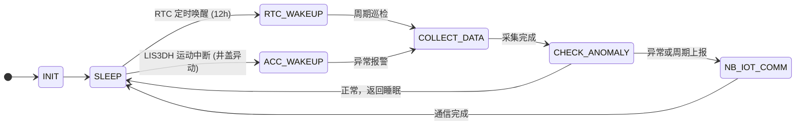

# 基于NB-IoT的低功耗城市下水道监控终端 软件开发技术文档

**项目名称**：基于NB-IoT的低功耗城市下水道异常工况远程监控终端
**主控芯片**：STM32L431RCT6
**通信模块**：EC-01G (NB-IoT)
**云平台**：巴法云 (MQTT)
**核心策略**：采集-判断-按需上报 (低功耗最优)

---

## 第一章 硬件与通信参数清单

### 1.1 核心硬件模块参数

| 模块名称 | 型号 | 关键参数 | 用途 |
| :--- | :--- | :--- | :--- |
| **主控芯片** | **STM32L431RCT6** | 80MHz, Cortex-M4, STOP 2 Mode | 系统控制与低功耗管理 |
| **NB-IoT 模块** | **EC-01G** | 支持 PSM/eDRX | 无线数据传输 |
| **气体传感器** | **MQ-4** | 甲烷/天然气检测，模拟量输出 | 沼气浓度监测 |
| **超声波测距** | **JSN-SR04T** | 测量范围 25cm - 4.5m | 水位深度监测 |
| **加速度计** | **LIS3DH** | I2C 接口，支持运动唤醒中断 | 井盖异动检测 |
| **电源系统** | **2x 18650 锂电池** | 7.4V 供电，PMOS 分时控制 | 供电与功耗管理 |

### 1.2 硬件引脚分配表

| 模块 | 引脚 | 功能 | 备注 |
| :--- | :--- | :--- | :--- |
| **MQ-4** | PA0 | ADC1_IN5 | 气体浓度模拟量输入 |
| **超声波** | PA6 | GPIO_Output | RADAR_TRIG (触发脉冲) |
| **超声波** | PA7 | GPIO_Input | RADAR_ECHO (回波接收) |
| **LIS3DH** | PA8 | EXTI8 | 运动唤醒中断 (最高优先级) |
| **电源控制** | PB0 | GPIO_Output | GAS_PWR_CTRL (MQ-4 电源) |
| **电源控制** | PB1 | GPIO_Output | RADAR_PWR_CTRL (超声波电源) |
| **霍尔** | PC5 | GPIO_Input | HALL_IN (井盖状态) |
| **NB-IoT** | PA2/PA3 | USART2_TX/RX | AT 指令通信 |

### 1.3 巴法云接入配置

| 参数项 | 值 | 备注 |
| :--- | :--- | :--- |
| **Client ID** | `dff51e3cf58147c687884a86b88b72ea` | 设备唯一标识 |
| **Key (Username)** | `AKRPL60J0004` | 认证密钥 |
| **MQTT Broker** | `mqtt.bemfa.com` | 服务器地址 |
| **MQTT Port** | `8333` | SSL/TLS 端口 |
| **Publish Topic** | `bfa/dff51e3cf58147c687884a86b88b72ea/AKRPL60J0004` | 数据上报主题 |

---

## 第二章 软件架构与核心状态机

### 2.1 软件架构分层

系统采用三层架构：**应用层**（状态机、业务逻辑）、**服务层**（数据处理、AT指令封装）、**驱动层**（BSP）。

```mermaid
graph TD
    A[应用逻辑层 (主状态机)] --> B[系统服务层 (低功耗/数据处理)];
    B --> C[硬件驱动层 (BSP)];
    C --> D[STM32 HAL/LL 库];
```

### 2.2 核心状态机流程

系统围绕低功耗和事件驱动设计，大部分时间处于 `SLEEP` 状态。



---

## 第三章 关键模块实现方案

### 3.1 低功耗管理 (BSP_LowPower)

| 动作 | 目标模式 | 唤醒源 | 关键代码 |
| :--- | :--- | :--- | :--- |
| **进入睡眠** | **STOP 2 Mode** | RTC WakeUp Timer / EXTI (PA8) | `HAL_PWR_EnterSTOP2Mode(PWR_STOPENTRY_WFI);` |
| **定时唤醒** | RTC WakeUp Timer | 12 小时 | `HAL_RTCEx_SetWakeUpTimer_IT(hrtc, 12*3600*32768/16, RTC_WAKEUPCLOCK_RTCCLK_DIV16);` |
| **异常唤醒** | LIS3DH EXTI8 | 井盖异动 | 配置 LIS3DH 阈值，使能 `HAL_NVIC_EnableIRQ(EXTI9_5_IRQn);` |

### 3.2 传感器采集逻辑 (BSP_Sensor)

#### 3.2.1 MQ-4 气体传感器
1.  **上电**：`BSP_Power_GasOn()` (PB0 拉低)。
2.  **预热**：`HAL_Delay(30000);` (30 秒)。
3.  **采集**：启动 ADC1 采集 PA0 模拟量。
4.  **断电**：`BSP_Power_GasOff()` (PB0 拉高)。

#### 3.2.2 JSN-SR04T 超声波测距
1.  **上电**：`BSP_Power_RadarOn()` (PB1 拉低)。
2.  **触发**：PA6 (TRIG) 发送 10us 高电平脉冲。
3.  **接收**：通过查询 PA7 (ECHO) 的高电平持续时间计算距离。
4.  **滤波**：**连续测量 5 次，取平均值**作为最终距离。
5.  **断电**：`BSP_Power_RadarOff()` (PB1 拉高)。

### 3.3 异常判断与报警阈值

在 `CHECK_ANOMALY` 状态，根据以下阈值判断是否需要立即上报：

| 异常类型 | 阈值 | 报警级别 |
| :--- | :--- | :--- |
| **井盖异动** | LIS3DH 运动唤醒或霍尔传感器触发 | **高** |
| **水位超限** | 水位距离 **< 50 cm** | **中** (内涝预警) |
| **气体超限** | 气体浓度 **> 1000 PPM** | **中** (可燃气泄漏预警) |
| **周期上报** | 每 **12 小时** | **低** (心跳包) |

---

## 第四章 NB-IoT 通信实现方案

### 4.1 通信流程

1.  **模块唤醒**：通过 GPIO 唤醒 EC-01G。
2.  **网络注册**：发送 `AT+CEREG?` 确保网络连接。
3.  **MQTT 连接**：使用 Client ID (`dff51e3cf58147c687884a86b88b72ea`) 和 Key (`AKRPL60J0004`) 连接 `mqtt.bemfa.com:8333`。
4.  **数据发布**：将采集到的数据封装为 JSON 格式，发布到指定 Topic。
5.  **模块休眠/断电**：发送 `AT+QPOWD=1` 或通过硬件断电，进入超低功耗状态。

### 4.2 数据上报 JSON 格式

```json
{
    "gas": [MQ-4 PPM],
    "water": [水位距离 cm],
    "hall": [霍尔状态 0/1],
    "acc_alarm": [LIS3DH 唤醒标志 0/1],
    "anomaly": [综合异常标志 0/1],
    "timestamp": [Unix 时间戳]
}
```
